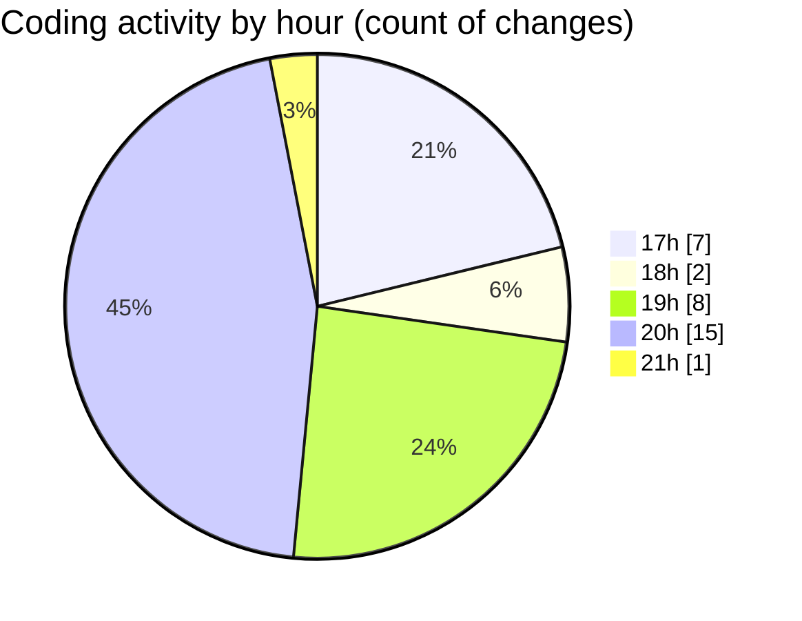

# MyWS (Workspace) - Activity Summary 

## Overall Statistics

| Stat                   | Value                                                             |
| ---------------------- | ----------------------------------------------------------------- |
| **Lines Added** (➕)   | 474                                          |
| **Lines Removed** (➖) | 17                                        |
| **Net Change** (↕)    | 457                |
| **Active Time** (⌚)   | 36 minutes |

## Modified Files
- **fingerprints.py** (+104, -6)
- **train_finger.py** (+370, -11)

## Visualizations

### By File Type (Lines Changed)

### By Hour (Estimated Activity Count)

> **Last Updated:** 12/01/2025, 21:02:47