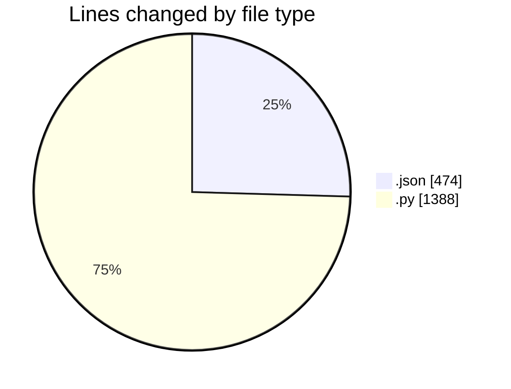
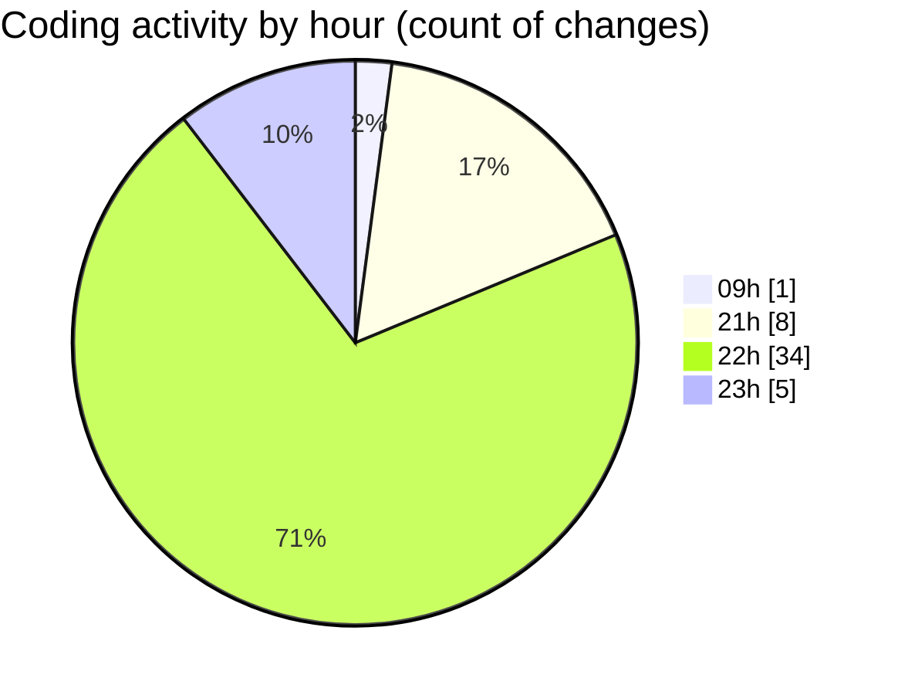

# MyWS (Workspace) - Activity Summary 

## Overall Statistics

| Stat                   | Value                                                             |
| ---------------------- | ----------------------------------------------------------------- |
| **Lines Added** (➕)   | 1432                                          |
| **Lines Removed** (➖) | 430                                        |
| **Net Change** (↕)    | 1002                |
| **Active Time** (⌚)   | 52 minutes |

## Modified Files
- **config.json** (+1, -0)
- **settings.json** (+1, -0)
- **vit_reco copy.py** (+376, -211)
- **train.py** (+130, -131)
- **vit_reco_2.py** (+449, -88)
- **vit_reco.py** (+3, -0)
- **trainer_state.json** (+472, -0)

## Visualizations

### By File Type (Lines Changed)

### By Hour (Estimated Activity Count)

> **Last Updated:** 19/02/2025, 23:14:19