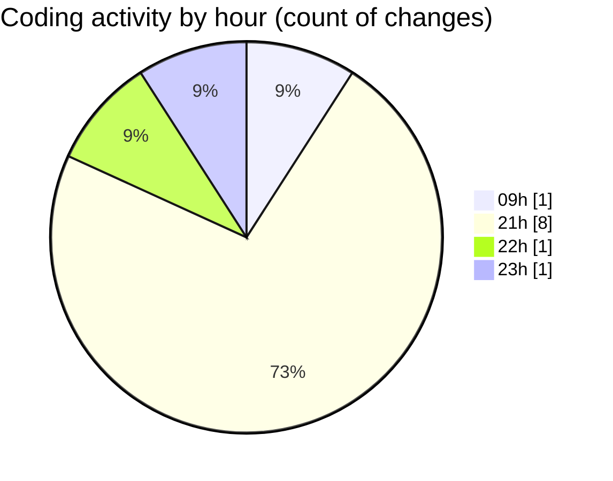

# MyWS (Workspace) - Activity Summary 

## Overall Statistics

| Stat                   | Value                                                             |
| ---------------------- | ----------------------------------------------------------------- |
| **Lines Added** (➕)   | 729                                          |
| **Lines Removed** (➖) | 343                                        |
| **Net Change** (↕)    | 386                |
| **Active Time** (⌚)   | 12 minutes |

## Modified Files
- **config.json** (+1, -0)
- **settings.json** (+1, -0)
- **vit_reco copy.py** (+376, -211)
- **train.py** (+130, -131)
- **vit_reco_2.py** (+221, -1)

## Visualizations

### By File Type (Lines Changed)

### By Hour (Estimated Activity Count)

> **Last Updated:** 19/02/2025, 22:04:19