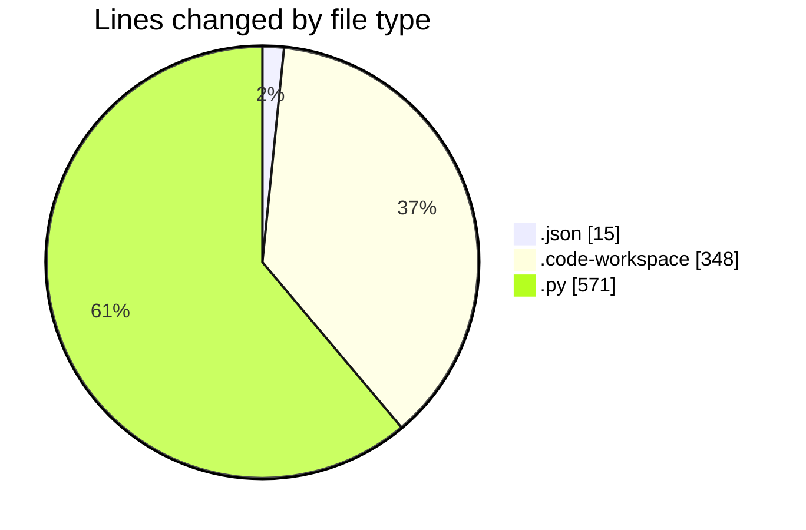
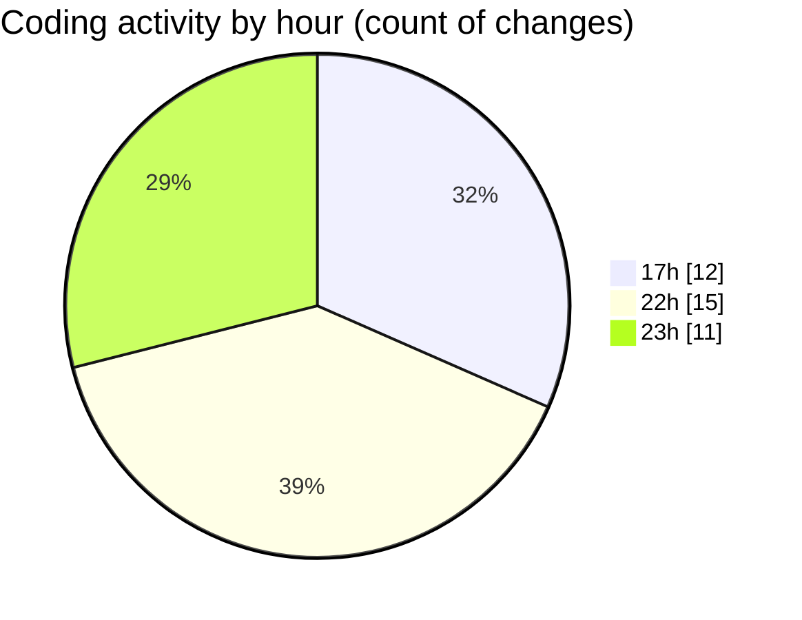

# MyWS (Workspace) - Activity Summary 

## Overall Statistics

| Stat                   | Value                                                             |
| ---------------------- | ----------------------------------------------------------------- |
| **Lines Added** (➕)   | 903                                          |
| **Lines Removed** (➖) | 31                                        |
| **Net Change** (↕)    | 872                |
| **Active Time** (⌚)   | 41 minutes |

## Modified Files
- **settings.json** (+15, -0)
- **MyWS.code-workspace** (+337, -11)
- **crop_image.py** (+112, -17)
- **augment.py** (+81, -3)
- **train.py** (+358, -0)

## Visualizations

### By File Type (Lines Changed)

### By Hour (Estimated Activity Count)

> **Last Updated:** 25/02/2025, 23:42:00