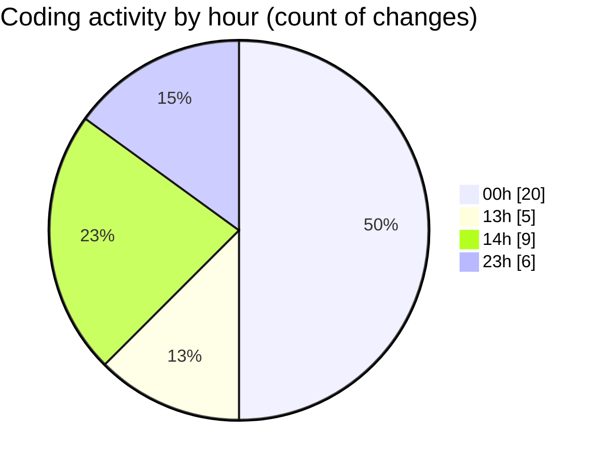

# MyWS (Workspace) - Activity Summary 

## Overall Statistics

| Stat                   | Value                                                             |
| ---------------------- | ----------------------------------------------------------------- |
| **Lines Added** (➕)   | 234                                          |
| **Lines Removed** (➖) | 136                                        |
| **Net Change** (↕)    | 98                |
| **Active Time** (⌚)   | 56 minutes |

## Modified Files
- **train.py** (+150, -55)
- **vit_reco_2.py** (+84, -81)

## Visualizations

### By File Type (Lines Changed)

### By Hour (Estimated Activity Count)

> **Last Updated:** 26/02/2025, 14:19:00