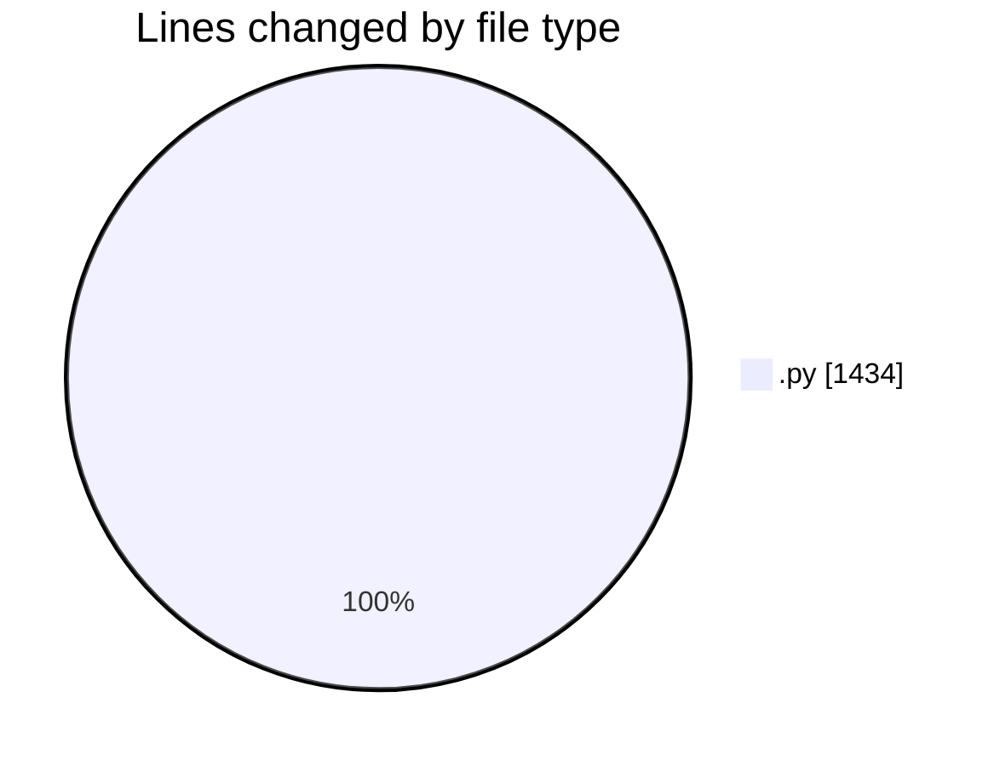
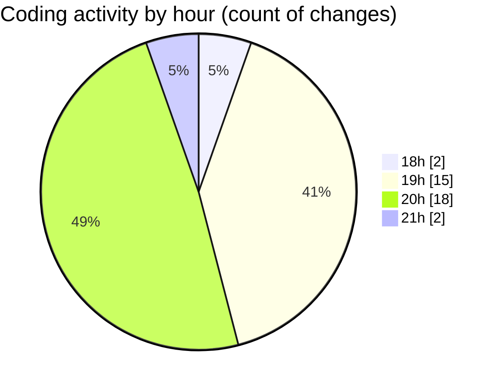

# MyWS (Workspace) - Activity Summary 

## Overall Statistics

| Stat                   | Value                                                             |
| ---------------------- | ----------------------------------------------------------------- |
| **Lines Added** (➕)   | 1053                                          |
| **Lines Removed** (➖) | 381                                        |
| **Net Change** (↕)    | 672                |
| **Active Time** (⌚)   | 39 minutes |

## Modified Files
- **vit_reco_2.py** (+124, -107)
- **vit_reco_2_random.py** (+472, -15)
- **vit_reco_2_cross.py** (+457, -259)

## Visualizations

### By File Type (Lines Changed)

### By Hour (Estimated Activity Count)

> **Last Updated:** 27/02/2025, 21:17:05