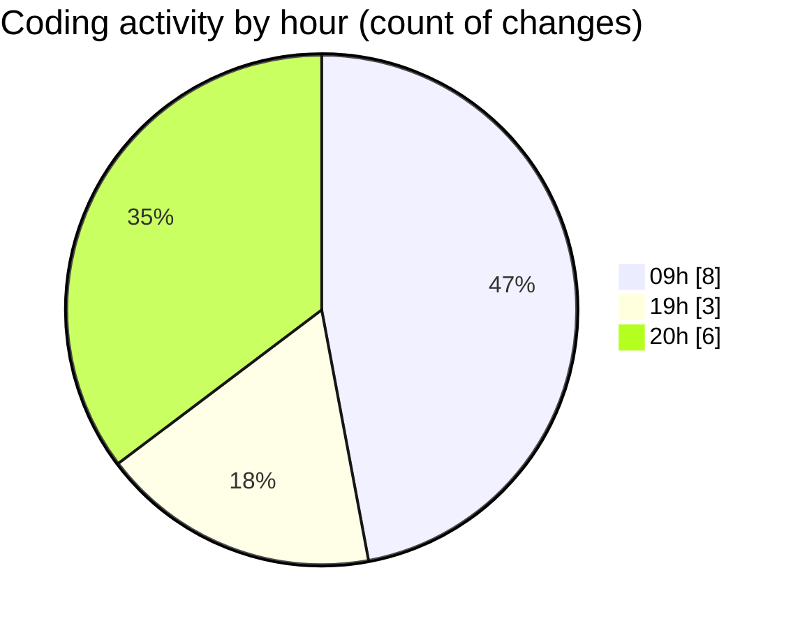

# MyWS (Workspace) - Activity Summary 

## Overall Statistics

| Stat                   | Value                                                             |
| ---------------------- | ----------------------------------------------------------------- |
| **Lines Added** (➕)   | 1209                                          |
| **Lines Removed** (➖) | 474                                        |
| **Net Change** (↕)    | 735                |
| **Active Time** (⌚)   | 15 minutes |

## Modified Files
- **vit_reco_2_cross.py** (+51, -0)
- **settings.json** (+15, -2)
- **vit_reco_2_random.py** (+456, -456)
- **train_finger.py** (+368, -1)
- **fingerprints_2.py** (+319, -15)

## Visualizations

### By File Type (Lines Changed)

### By Hour (Estimated Activity Count)

> **Last Updated:** 28/02/2025, 20:59:15