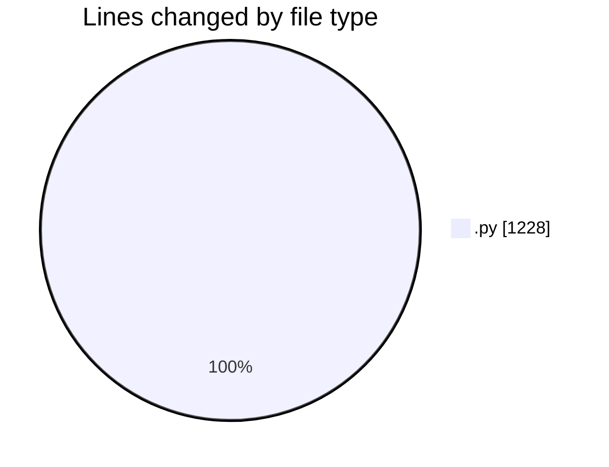

# MyWS (Workspace) - Activity Summary 

## Overall Statistics

| Stat                   | Value                                                             |
| ---------------------- | ----------------------------------------------------------------- |
| **Lines Added** (➕)   | 1140                                          |
| **Lines Removed** (➖) | 88                                        |
| **Net Change** (↕)    | 1052                |
| **Active Time** (⌚)   | 27 minutes |

## Modified Files
- **fingerprints_3.py** (+353, -58)
- **train.py** (+453, -0)
- **fingerprints_2.py** (+334, -30)

## Visualizations

### By File Type (Lines Changed)

### By Hour (Estimated Activity Count)

> **Last Updated:** 01/03/2025, 10:46:43