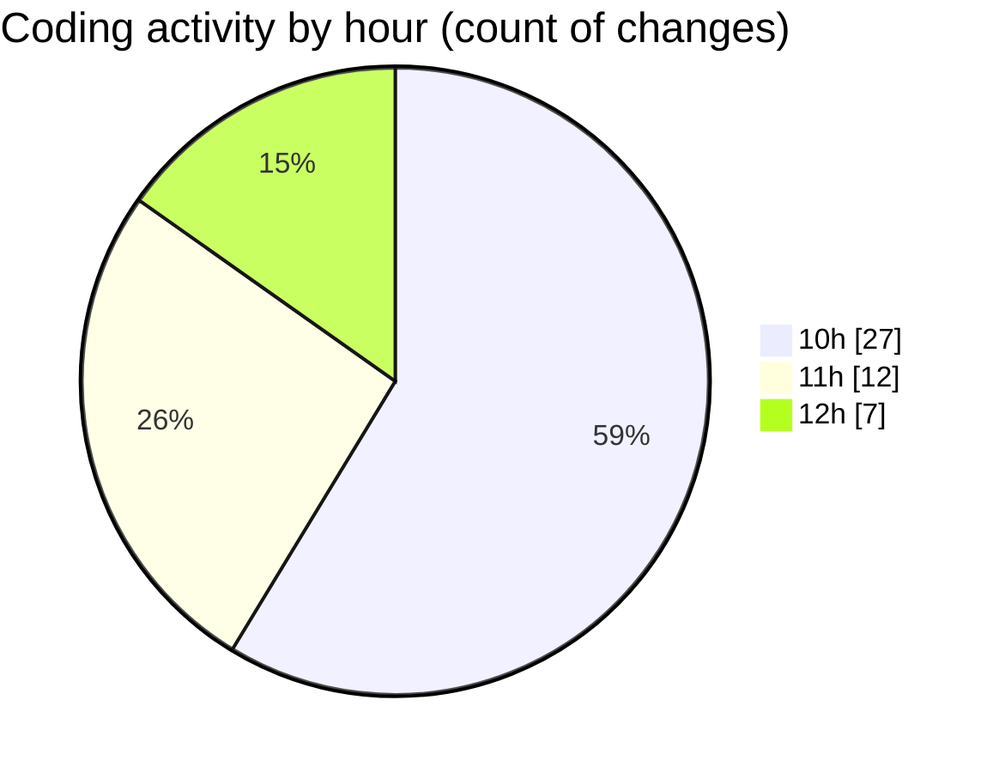

# MyWS (Workspace) - Activity Summary 

## Overall Statistics

| Stat                   | Value                                                             |
| ---------------------- | ----------------------------------------------------------------- |
| **Lines Added** (➕)   | 2022                                          |
| **Lines Removed** (➖) | 441                                        |
| **Net Change** (↕)    | 1581                |
| **Active Time** (⌚)   | 57 minutes |

## Modified Files
- **fingerprints_3.py** (+353, -58)
- **train.py** (+453, -0)
- **fingerprints_2.py** (+360, -30)
- **fingerprints_2b.py** (+637, -303)
- **01_vgg.py** (+219, -50)

## Visualizations

### By File Type (Lines Changed)

### By Hour (Estimated Activity Count)

> **Last Updated:** 01/03/2025, 12:06:44