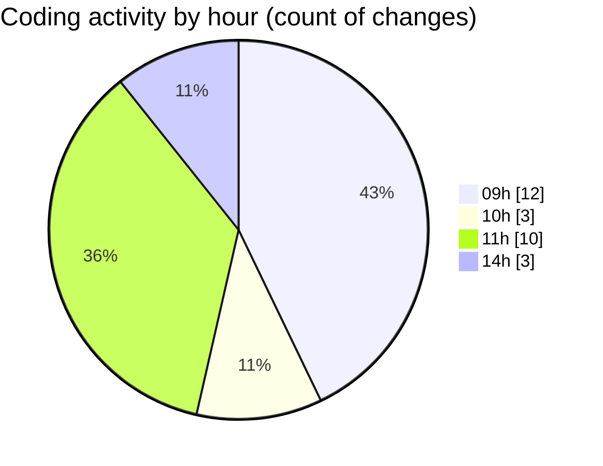

# MyWS (Workspace) - Activity Summary 

## Overall Statistics

| Stat                   | Value                                                             |
| ---------------------- | ----------------------------------------------------------------- |
| **Lines Added** (➕)   | 1250                                          |
| **Lines Removed** (➖) | 496                                        |
| **Net Change** (↕)    | 754                |
| **Active Time** (⌚)   | 27 minutes |

## Modified Files
- **fingerprints_2b.py** (+861, -496)
- **fingerprints_svm.py** (+389, -0)

## Visualizations

### By File Type (Lines Changed)

### By Hour (Estimated Activity Count)

> **Last Updated:** 08/03/2025, 14:14:40