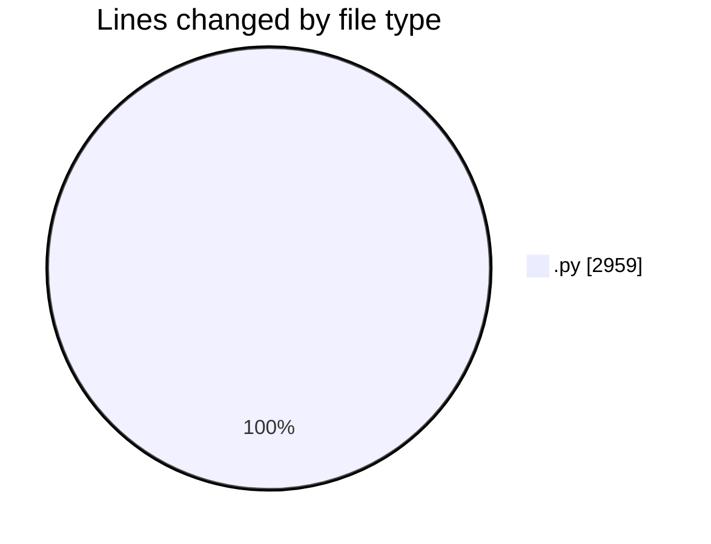
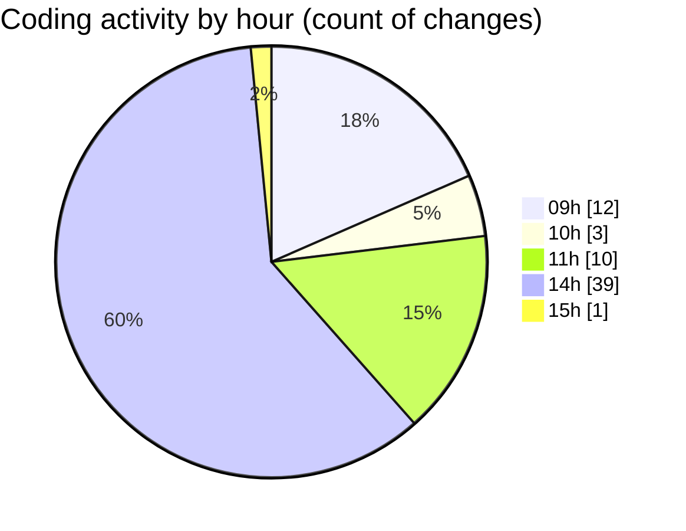

# MyWS (Workspace) - Activity Summary 

## Overall Statistics

| Stat                   | Value                                                             |
| ---------------------- | ----------------------------------------------------------------- |
| **Lines Added** (➕)   | 2075                                          |
| **Lines Removed** (➖) | 884                                        |
| **Net Change** (↕)    | 1191                |
| **Active Time** (⌚)   | 68 minutes |

## Modified Files
- **fingerprints_2b.py** (+861, -496)
- **fingerprints_svm.py** (+792, -251)
- **fin_untils.py** (+291, -137)
- **util_augmentation.py** (+131, -0)

## Visualizations

### By File Type (Lines Changed)

### By Hour (Estimated Activity Count)

> **Last Updated:** 08/03/2025, 15:39:40