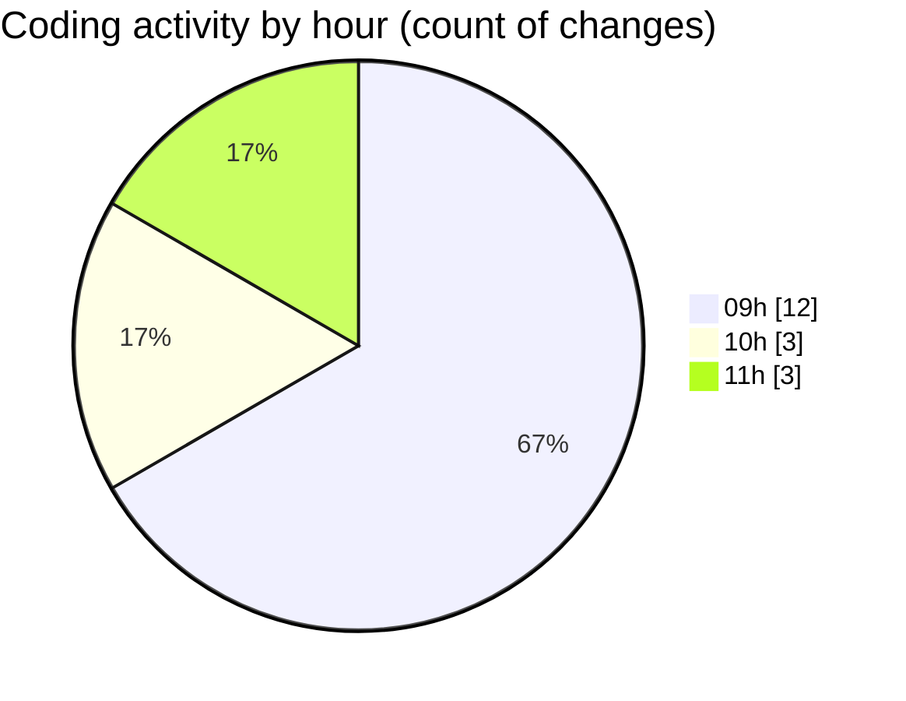

# MyWS (Workspace) - Activity Summary 

## Overall Statistics

| Stat                   | Value                                                             |
| ---------------------- | ----------------------------------------------------------------- |
| **Lines Added** (➕)   | 650                                          |
| **Lines Removed** (➖) | 79                                        |
| **Net Change** (↕)    | 571                |
| **Active Time** (⌚)   | 16 minutes |

## Modified Files
- **fingerprints_2b.py** (+650, -79)

## Visualizations

### By File Type (Lines Changed)

### By Hour (Estimated Activity Count)

> **Last Updated:** 08/03/2025, 11:04:50