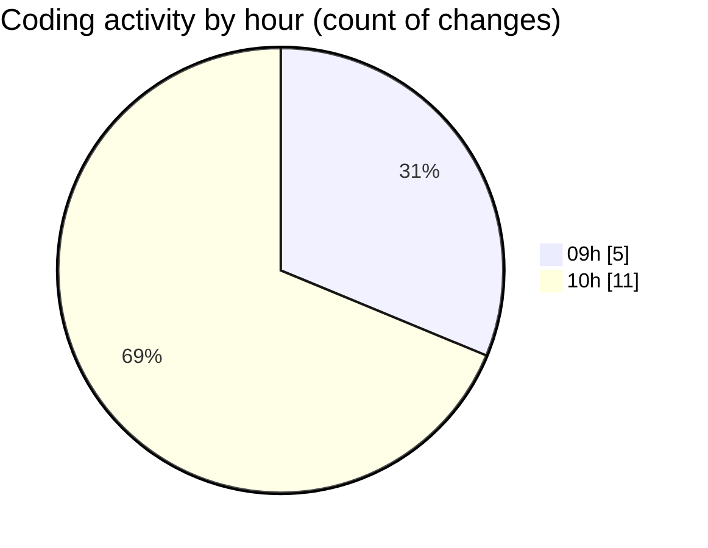

# MyWS (Workspace) - Activity Summary 

## Overall Statistics

| Stat                   | Value                                                             |
| ---------------------- | ----------------------------------------------------------------- |
| **Lines Added** (➕)   | 328                                          |
| **Lines Removed** (➖) | 0                                        |
| **Net Change** (↕)    | 328                |
| **Active Time** (⌚)   | 19 minutes |

## Modified Files
- **fingerprints_all.py** (+325, -0)
- **config.yaml** (+3, -0)

## Visualizations

### By File Type (Lines Changed)

### By Hour (Estimated Activity Count)

> **Last Updated:** 09/03/2025, 10:16:32