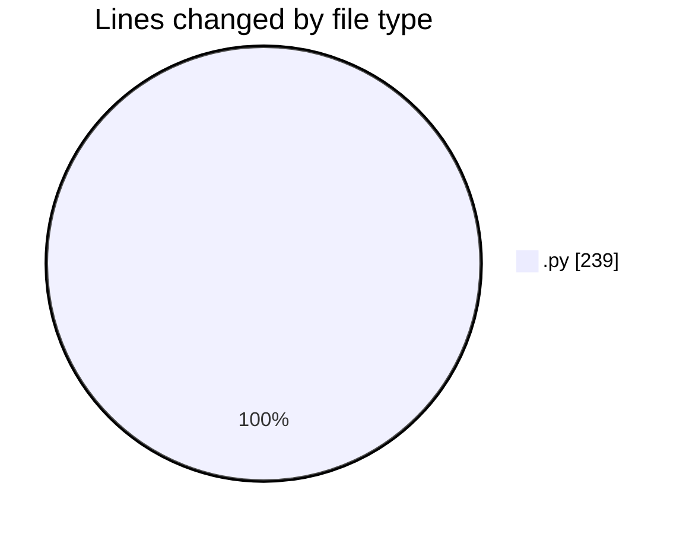
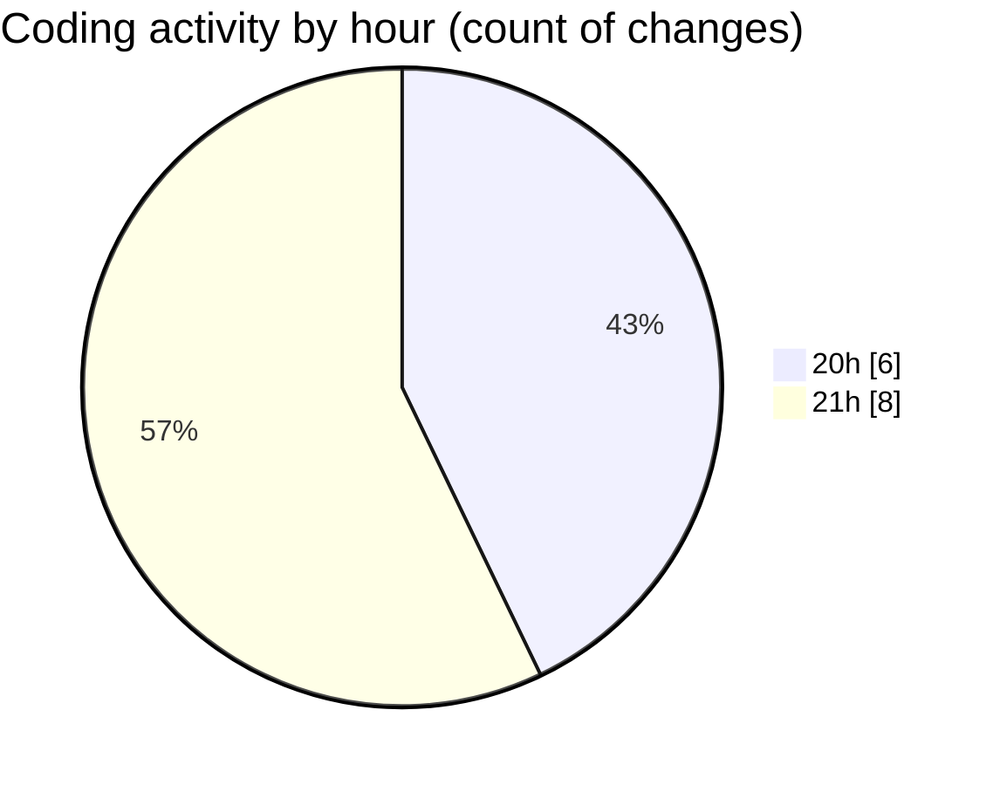

# MyWS (Workspace) - Activity Summary 

## Overall Statistics

| Stat                   | Value                                                             |
| ---------------------- | ----------------------------------------------------------------- |
| **Lines Added** (➕)   | 236                                          |
| **Lines Removed** (➖) | 3                                        |
| **Net Change** (↕)    | 233                |
| **Active Time** (⌚)   | 20 minutes |

## Modified Files
- **fingerprints_2c.py** (+236, -3)

## Visualizations

### By File Type (Lines Changed)

### By Hour (Estimated Activity Count)

> **Last Updated:** 12/03/2025, 21:37:25