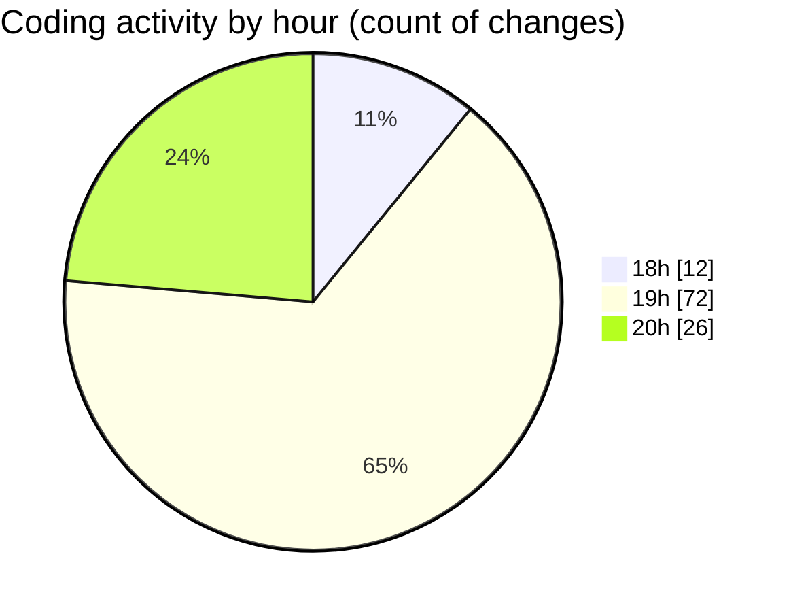

# MyWS (Workspace) - Activity Summary 

## Overall Statistics

| Stat                   | Value                                                             |
| ---------------------- | ----------------------------------------------------------------- |
| **Lines Added** (➕)   | 15339                                          |
| **Lines Removed** (➖) | 1909                                        |
| **Net Change** (↕)    | 13430                |
| **Active Time** (⌚)   | 149 minutes |

## Modified Files
- **MyWS.code-workspace** (+77, -0)
- **merge.ipynb** (+15262, -1909)

## Visualizations

### By File Type (Lines Changed)

### By Hour (Estimated Activity Count)

> **Last Updated:** 14/03/2025, 20:55:05