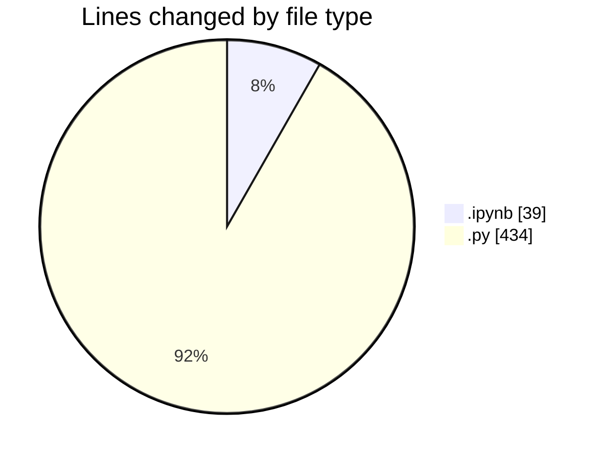
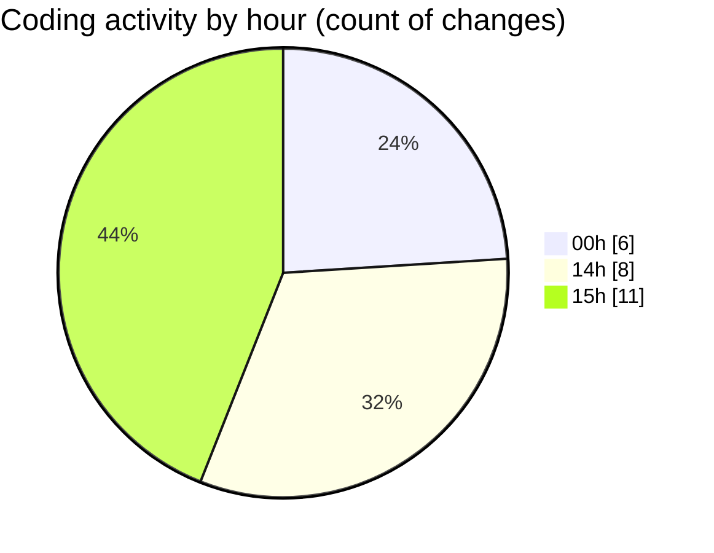

# MyWS (Workspace) - Activity Summary 

## Overall Statistics

| Stat                   | Value                                                             |
| ---------------------- | ----------------------------------------------------------------- |
| **Lines Added** (➕)   | 443                                          |
| **Lines Removed** (➖) | 30                                        |
| **Net Change** (↕)    | 413                |
| **Active Time** (⌚)   | 23 minutes |

## Modified Files
- **merge.ipynb** (+38, -1)
- **fingerprints_2d.py** (+405, -29)

## Visualizations

### By File Type (Lines Changed)

### By Hour (Estimated Activity Count)

> **Last Updated:** 15/03/2025, 15:26:18