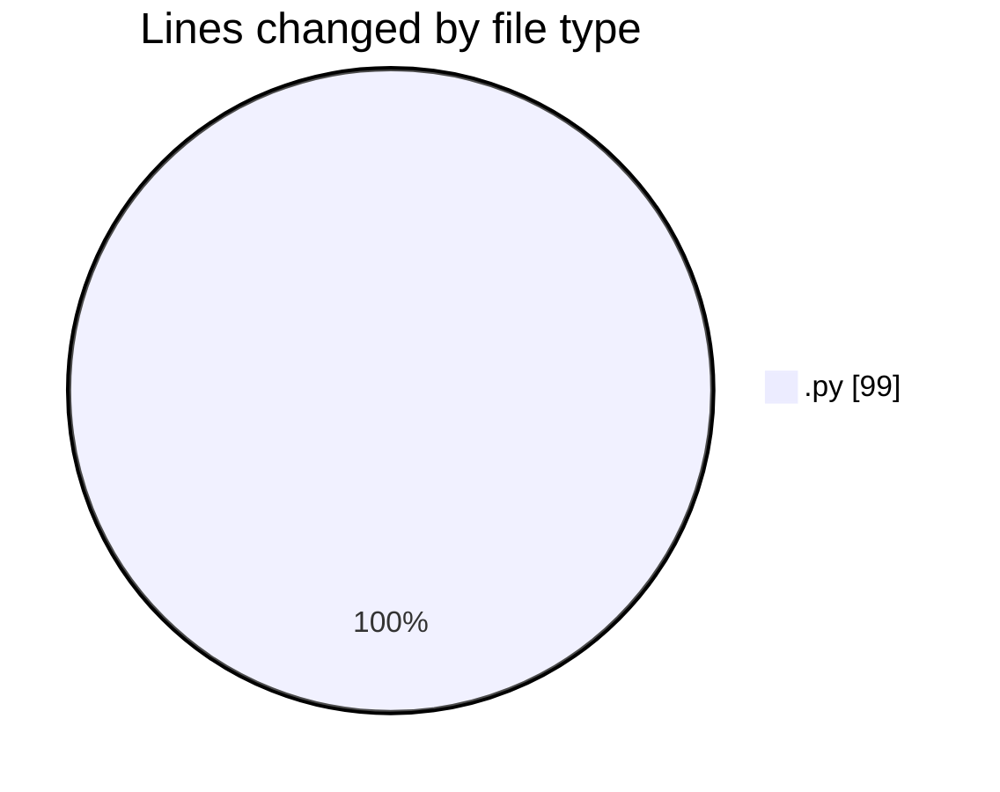

# MyWS (Workspace) - Activity Summary 

## Overall Statistics

| Stat                   | Value                                                             |
| ---------------------- | ----------------------------------------------------------------- |
| **Lines Added** (➕)   | 99                                          |
| **Lines Removed** (➖) | 0                                        |
| **Net Change** (↕)    | 99                |
| **Active Time** (⌚)   | 5 minutes |

## Modified Files
- **util_edit_datasets.py** (+58, -0)
- **run_predict_ridb_all.py** (+41, -0)

## Visualizations

### By File Type (Lines Changed)

### By Hour (Estimated Activity Count)

> **Last Updated:** 16/03/2025, 22:45:44