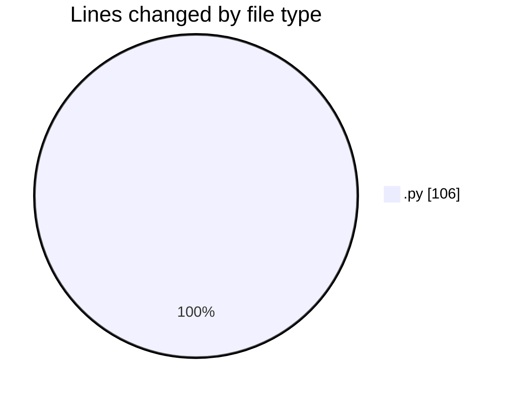
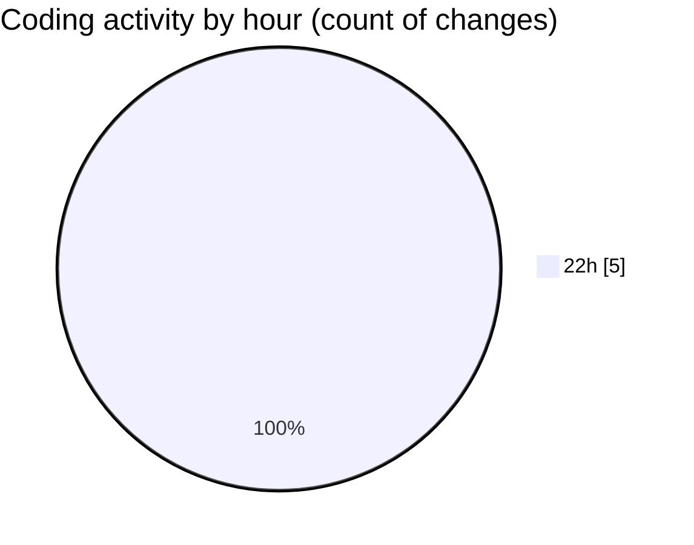

# MyWS (Workspace) - Activity Summary 

## Overall Statistics

| Stat                   | Value                                                             |
| ---------------------- | ----------------------------------------------------------------- |
| **Lines Added** (➕)   | 106                                          |
| **Lines Removed** (➖) | 0                                        |
| **Net Change** (↕)    | 106                |
| **Active Time** (⌚)   | 7 minutes |

## Modified Files
- **util_edit_datasets.py** (+58, -0)
- **run_predict_ridb_all.py** (+48, -0)

## Visualizations

### By File Type (Lines Changed)

### By Hour (Estimated Activity Count)

> **Last Updated:** 16/03/2025, 22:50:44