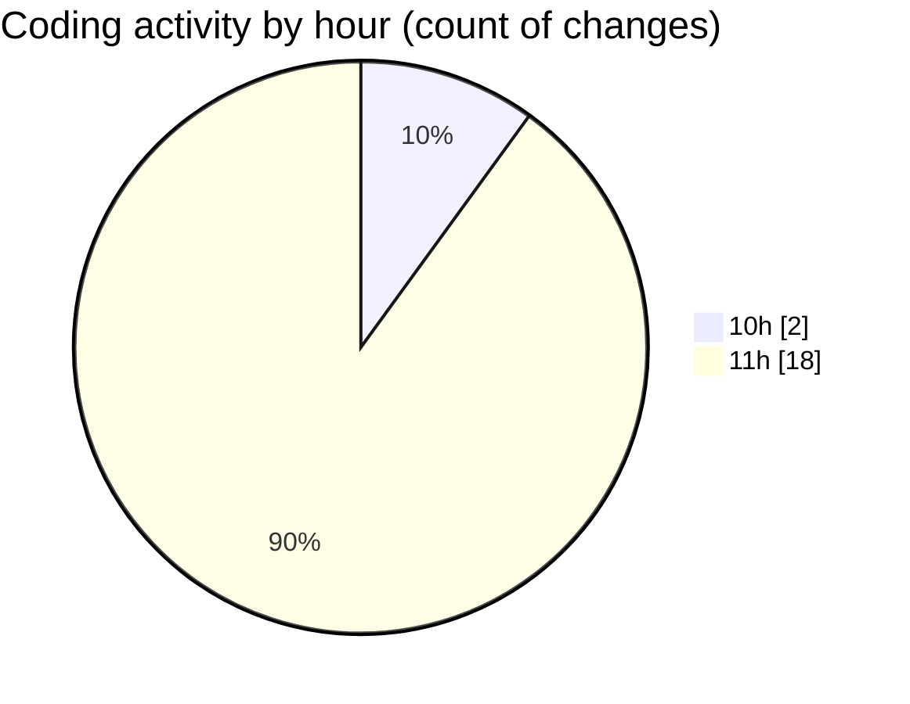

# MyWS (Workspace) - Activity Summary 

## Overall Statistics

| Stat                   | Value                                                             |
| ---------------------- | ----------------------------------------------------------------- |
| **Lines Added** (➕)   | 251                                          |
| **Lines Removed** (➖) | 14                                        |
| **Net Change** (↕)    | 237                |
| **Active Time** (⌚)   | 19 minutes |

## Modified Files
- **divide.py** (+53, -0)
- **augment.py** (+198, -14)

## Visualizations

### By File Type (Lines Changed)

### By Hour (Estimated Activity Count)

> **Last Updated:** 17/03/2025, 11:32:37