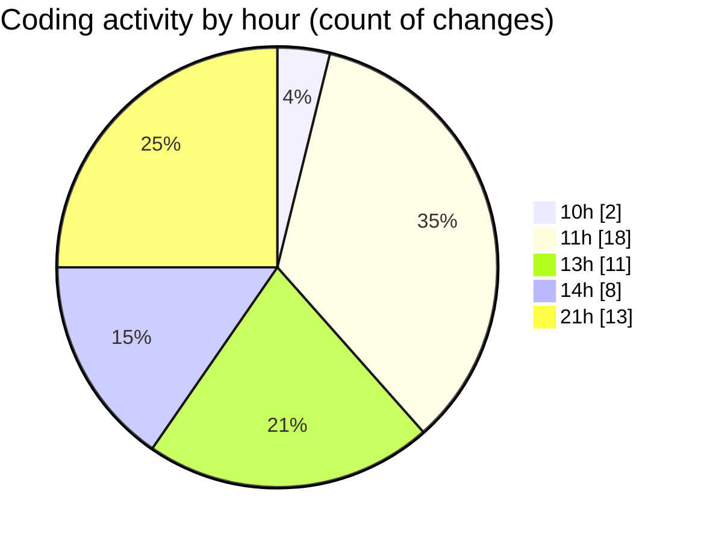

# MyWS (Workspace) - Activity Summary 

## Overall Statistics

| Stat                   | Value                                                             |
| ---------------------- | ----------------------------------------------------------------- |
| **Lines Added** (➕)   | 1063                                          |
| **Lines Removed** (➖) | 18                                        |
| **Net Change** (↕)    | 1045                |
| **Active Time** (⌚)   | 54 minutes |

## Modified Files
- **divide.py** (+53, -0)
- **augment.py** (+198, -14)
- **.gitignore** (+56, -0)
- **fingerprints_2d.py** (+462, -1)
- **predict_one_image.py** (+245, -3)
- **run_predict_ridb_all.py** (+49, -0)

## Visualizations

### By File Type (Lines Changed)

### By Hour (Estimated Activity Count)

> **Last Updated:** 17/03/2025, 21:47:46