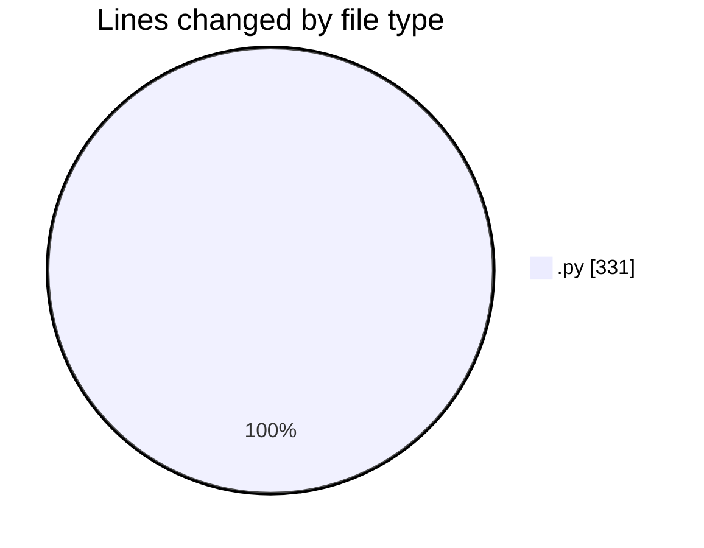

# MyWS (Workspace) - Activity Summary 

## Overall Statistics

| Stat                   | Value                                                             |
| ---------------------- | ----------------------------------------------------------------- |
| **Lines Added** (➕)   | 331                                          |
| **Lines Removed** (➖) | 0                                        |
| **Net Change** (↕)    | 331                |
| **Active Time** (⌚)   | 3 minutes |

## Modified Files
- **fingerprints.py** (+98, -0)
- **fingerprints_2c.py** (+233, -0)

## Visualizations

### By File Type (Lines Changed)

### By Hour (Estimated Activity Count)

> **Last Updated:** 18/03/2025, 17:55:49