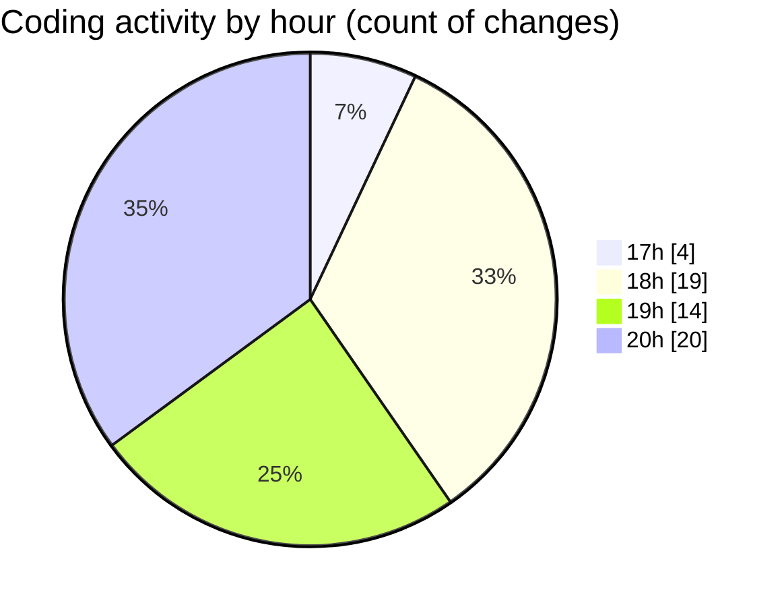

# MyWS (Workspace) - Activity Summary 

## Overall Statistics

| Stat                   | Value                                                             |
| ---------------------- | ----------------------------------------------------------------- |
| **Lines Added** (➕)   | 1339                                          |
| **Lines Removed** (➖) | 68                                        |
| **Net Change** (↕)    | 1271                |
| **Active Time** (⌚)   | 71 minutes |

## Modified Files
- **fingerprints.py** (+98, -0)
- **fingerprints_2c.py** (+238, -0)
- **fingerprints_2d.py** (+621, -38)
- **run_predict_ridb_all.py** (+83, -28)
- **divide.py** (+53, -0)
- **augment.py** (+246, -2)

## Visualizations

### By File Type (Lines Changed)

### By Hour (Estimated Activity Count)

> **Last Updated:** 18/03/2025, 20:45:49