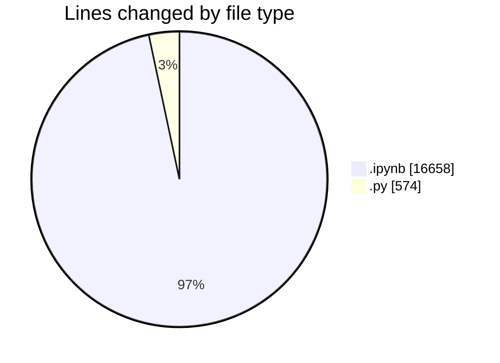
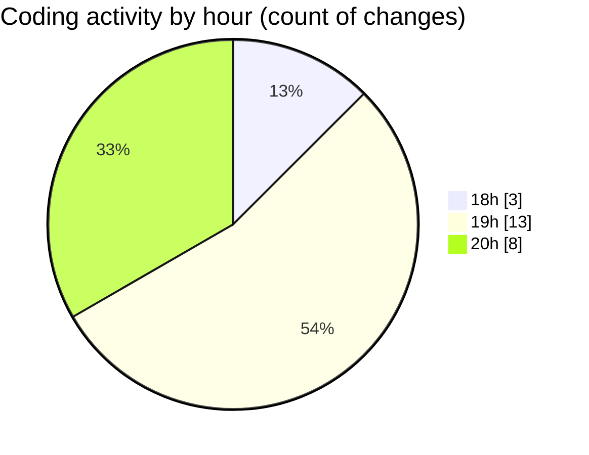

# MyWS (Workspace) - Activity Summary 

## Overall Statistics

| Stat                   | Value                                                             |
| ---------------------- | ----------------------------------------------------------------- |
| **Lines Added** (➕)   | 17123                                          |
| **Lines Removed** (➖) | 109                                        |
| **Net Change** (↕)    | 17014                |
| **Active Time** (⌚)   | 32 minutes |

## Modified Files
- **merge.ipynb** (+16658, -0)
- **dea.py** (+465, -109)

## Visualizations

### By File Type (Lines Changed)

### By Hour (Estimated Activity Count)

> **Last Updated:** 20/03/2025, 20:23:27