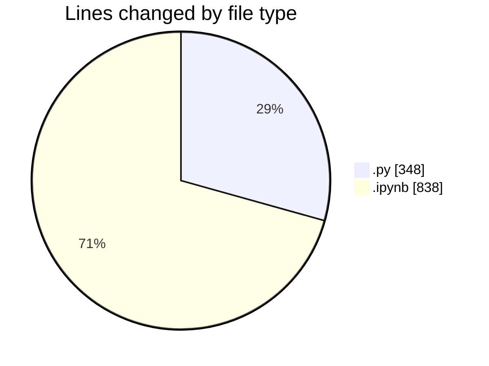
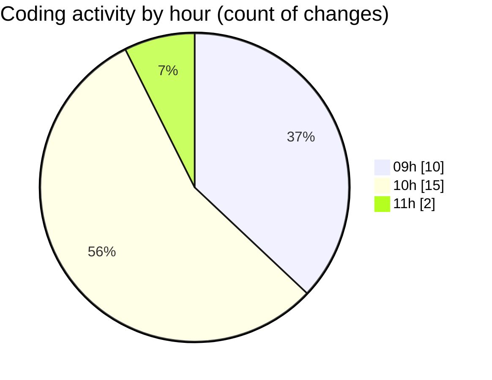

# MyWS (Workspace) - Activity Summary 

## Overall Statistics

| Stat                   | Value                                                             |
| ---------------------- | ----------------------------------------------------------------- |
| **Lines Added** (➕)   | 1151                                          |
| **Lines Removed** (➖) | 35                                        |
| **Net Change** (↕)    | 1116                |
| **Active Time** (⌚)   | 33 minutes |

## Modified Files
- **dea.py** (+325, -23)
- **merge.ipynb** (+826, -12)

## Visualizations

### By File Type (Lines Changed)

### By Hour (Estimated Activity Count)

> **Last Updated:** 21/03/2025, 11:01:40