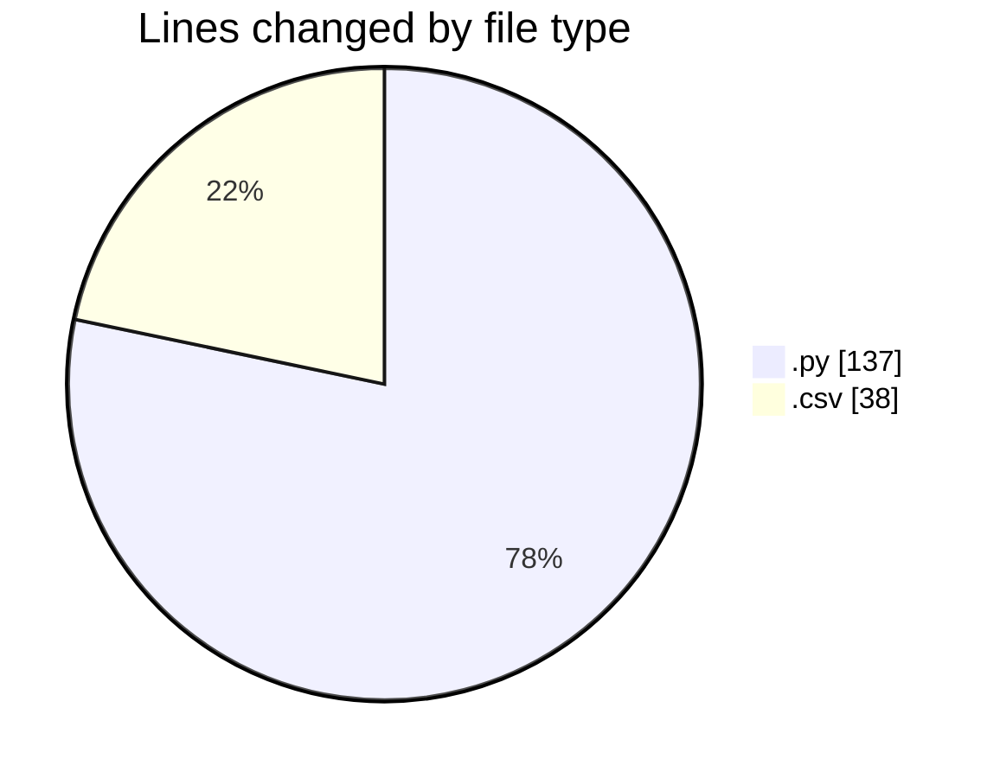
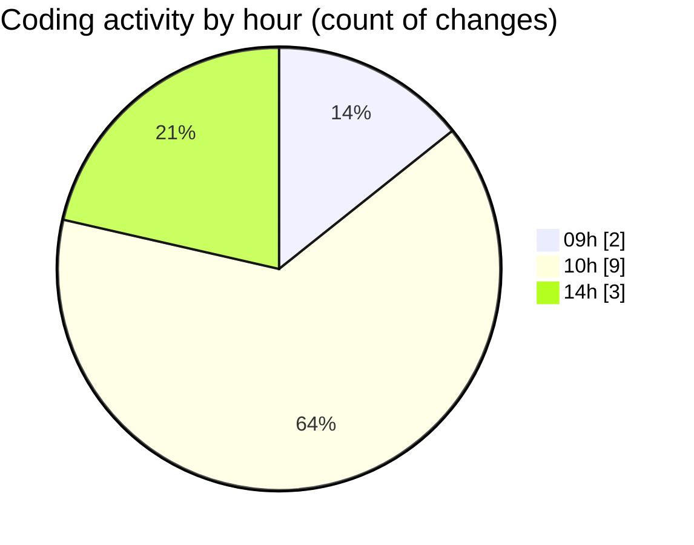

# MyWS (Workspace) - Activity Summary 

## Overall Statistics

| Stat                   | Value                                                             |
| ---------------------- | ----------------------------------------------------------------- |
| **Lines Added** (➕)   | 165                                          |
| **Lines Removed** (➖) | 10                                        |
| **Net Change** (↕)    | 155                |
| **Active Time** (⌚)   | 10 minutes |

## Modified Files
- **dea.py** (+67, -10)
- **dea_superefficiency_table.csv** (+38, -0)
- **run_predict_ridb_all.py** (+60, -0)

## Visualizations

### By File Type (Lines Changed)

### By Hour (Estimated Activity Count)

> **Last Updated:** 11/04/2025, 14:32:20