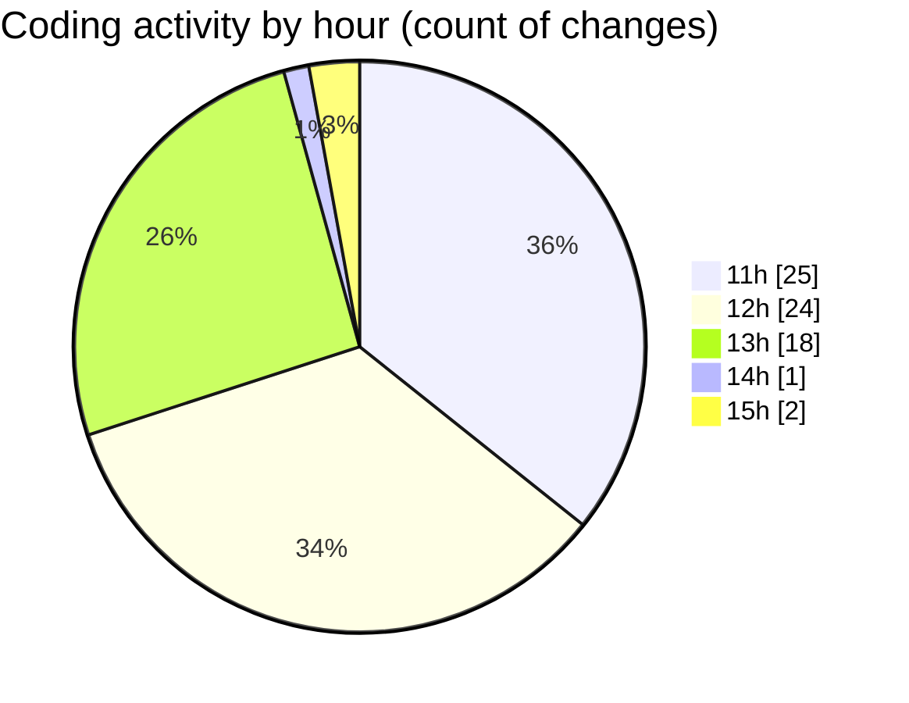

# MyWS (Workspace) - Activity Summary 

## Overall Statistics

| Stat                   | Value                                                             |
| ---------------------- | ----------------------------------------------------------------- |
| **Lines Added** (➕)   | 2176                                          |
| **Lines Removed** (➖) | 110                                        |
| **Net Change** (↕)    | 2066                |
| **Active Time** (⌚)   | 88 minutes |

## Modified Files
- **res_to_512.py** (+46, -0)
- **fingerprints_2d.py** (+938, -31)
- **fingerprints_2g.py** (+1150, -79)
- **filter_images.py** (+42, -0)

## Visualizations

### By File Type (Lines Changed)

### By Hour (Estimated Activity Count)

> **Last Updated:** 12/04/2025, 15:09:54