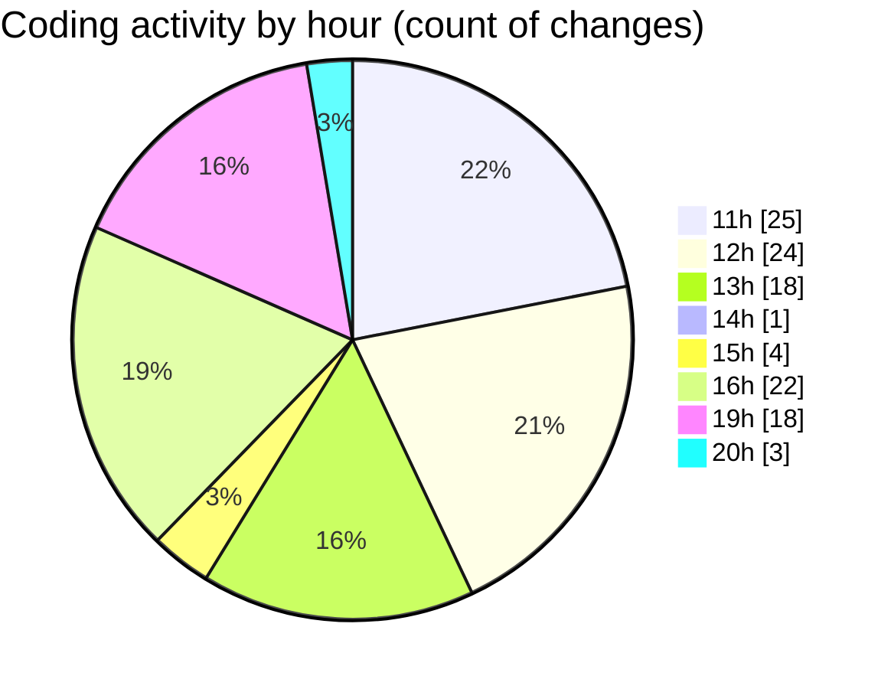

# MyWS (Workspace) - Activity Summary 

## Overall Statistics

| Stat                   | Value                                                             |
| ---------------------- | ----------------------------------------------------------------- |
| **Lines Added** (➕)   | 7879                                          |
| **Lines Removed** (➖) | 776                                        |
| **Net Change** (↕)    | 7103                |
| **Active Time** (⌚)   | 134 minutes |

## Modified Files
- **res_to_512.py** (+46, -0)
- **fingerprints_2d.py** (+938, -31)
- **fingerprints_2g.py** (+1150, -79)
- **filter_images.py** (+42, -0)
- **fingerprints_2g_person1.py** (+2139, -103)
- **fingerprints.py** (+173, -43)
- **fingerprints_2g_person_pca.py** (+1453, -509)
- **fingerprints_2g_person_onlyG.py** (+944, -11)
- **fingerprints_2g_person_onlyG2p.py** (+994, -0)

## Visualizations

### By File Type (Lines Changed)

### By Hour (Estimated Activity Count)

> **Last Updated:** 12/04/2025, 20:25:43