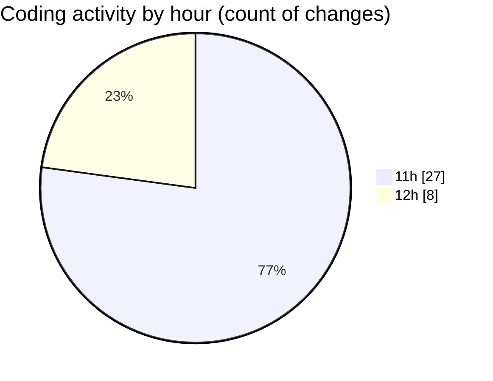

# MyWS (Workspace) - Activity Summary 

## Overall Statistics

| Stat                   | Value                                                             |
| ---------------------- | ----------------------------------------------------------------- |
| **Lines Added** (➕)   | 1137                                          |
| **Lines Removed** (➖) | 246                                        |
| **Net Change** (↕)    | 891                |
| **Active Time** (⌚)   | 40 minutes |

## Modified Files
- **00_non_visual.py** (+1137, -246)

## Visualizations

### By File Type (Lines Changed)

### By Hour (Estimated Activity Count)

> **Last Updated:** 18/04/2025, 12:44:24