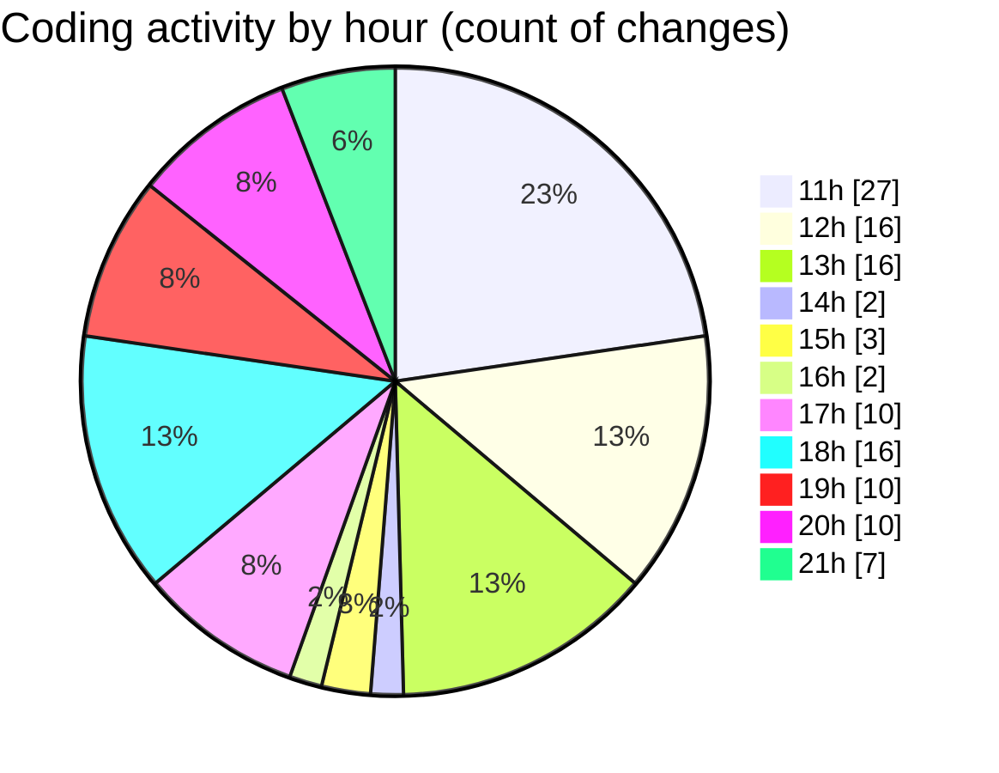

# MyWS (Workspace) - Activity Summary 

## Overall Statistics

| Stat                   | Value                                                             |
| ---------------------- | ----------------------------------------------------------------- |
| **Lines Added** (➕)   | 6793                                          |
| **Lines Removed** (➖) | 1511                                        |
| **Net Change** (↕)    | 5282                |
| **Active Time** (⌚)   | 136 minutes |

## Modified Files
- **00_non_visual.py** (+2209, -1255)
- **01_classification.py** (+960, -147)
- **03_non_visual_kfold.py** (+959, -61)
- **00_non_visual_grat.py** (+983, -17)
- **04_non_visual_grat.py** (+998, -1)
- **crop_image.py** (+98, -0)
- **fingerprints.py** (+139, -30)
- **fingerprints_2c.py** (+241, -0)
- **05_extractor.py** (+206, -0)

## Visualizations

### By File Type (Lines Changed)

### By Hour (Estimated Activity Count)

> **Last Updated:** 18/04/2025, 21:13:53