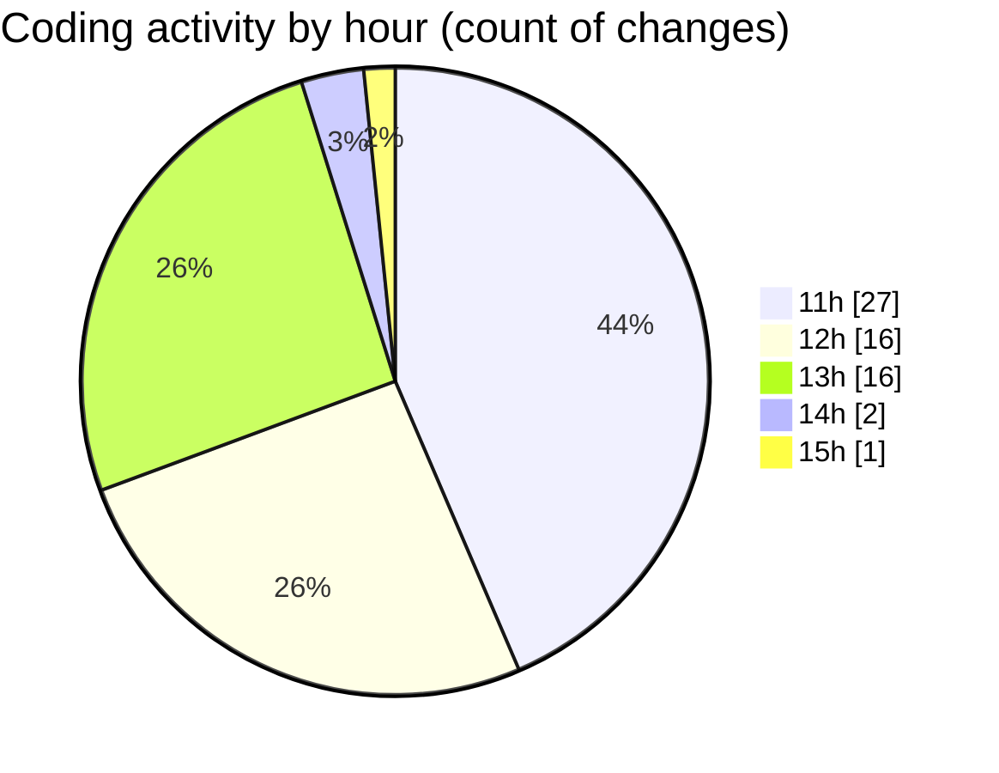

# MyWS (Workspace) - Activity Summary 

## Overall Statistics

| Stat                   | Value                                                             |
| ---------------------- | ----------------------------------------------------------------- |
| **Lines Added** (➕)   | 3040                                          |
| **Lines Removed** (➖) | 1302                                        |
| **Net Change** (↕)    | 1738                |
| **Active Time** (⌚)   | 77 minutes |

## Modified Files
- **00_non_visual.py** (+2082, -1155)
- **01_classification.py** (+958, -147)

## Visualizations

### By File Type (Lines Changed)

### By Hour (Estimated Activity Count)

> **Last Updated:** 18/04/2025, 15:53:53