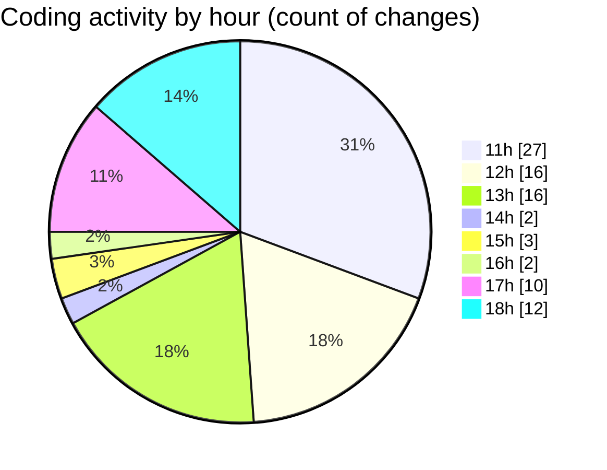

# MyWS (Workspace) - Activity Summary 

## Overall Statistics

| Stat                   | Value                                                             |
| ---------------------- | ----------------------------------------------------------------- |
| **Lines Added** (➕)   | 6064                                          |
| **Lines Removed** (➖) | 1476                                        |
| **Net Change** (↕)    | 4588                |
| **Active Time** (⌚)   | 102 minutes |

## Modified Files
- **00_non_visual.py** (+2209, -1255)
- **01_classification.py** (+960, -147)
- **03_non_visual_kfold.py** (+940, -56)
- **00_non_visual_grat.py** (+983, -17)
- **04_non_visual_grat.py** (+972, -1)

## Visualizations

### By File Type (Lines Changed)

### By Hour (Estimated Activity Count)

> **Last Updated:** 18/04/2025, 18:28:53