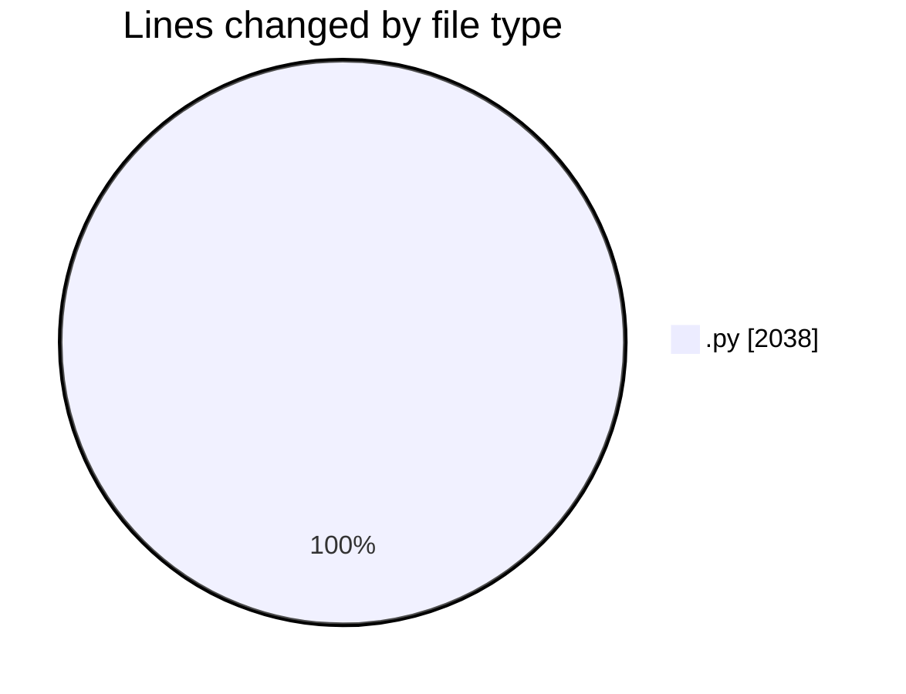
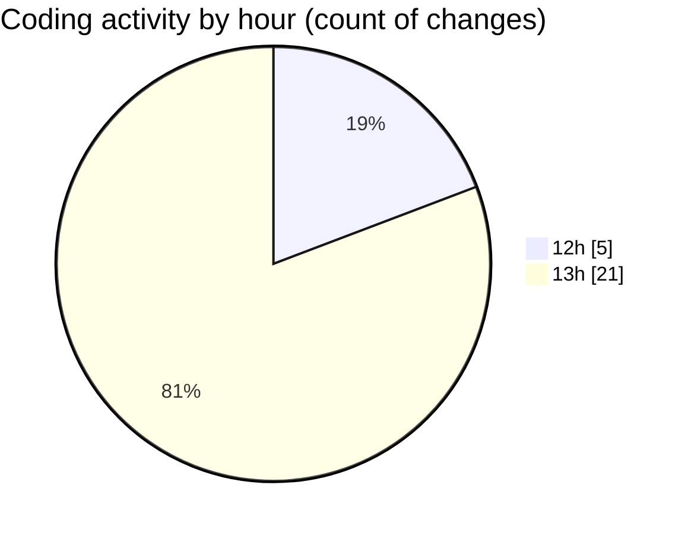

# MyWS (Workspace) - Activity Summary 

## Overall Statistics

| Stat                   | Value                                                             |
| ---------------------- | ----------------------------------------------------------------- |
| **Lines Added** (➕)   | 1946                                          |
| **Lines Removed** (➖) | 92                                        |
| **Net Change** (↕)    | 1854                |
| **Active Time** (⌚)   | 35 minutes |

## Modified Files
- **03_non_visual_kfold.py** (+0, -1)
- **06_non_visual_spec_folders.py** (+1045, -82)
- **07_augment.py** (+75, -0)
- **08_classification_spec_folders.py** (+826, -9)

## Visualizations

### By File Type (Lines Changed)

### By Hour (Estimated Activity Count)

> **Last Updated:** 19/04/2025, 13:52:09