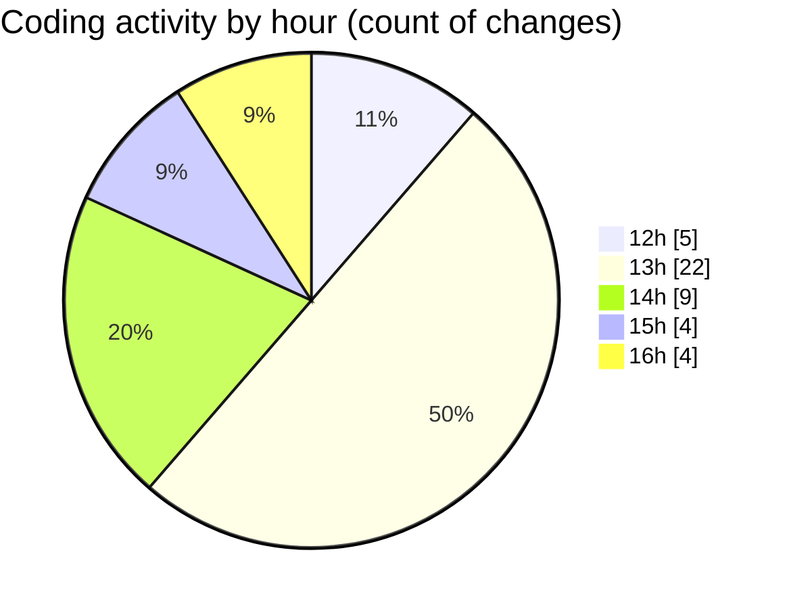

# MyWS (Workspace) - Activity Summary 

## Overall Statistics

| Stat                   | Value                                                             |
| ---------------------- | ----------------------------------------------------------------- |
| **Lines Added** (➕)   | 1992                                          |
| **Lines Removed** (➖) | 109                                        |
| **Net Change** (↕)    | 1883                |
| **Active Time** (⌚)   | 51 minutes |

## Modified Files
- **03_non_visual_kfold.py** (+0, -1)
- **06_non_visual_spec_folders.py** (+1060, -88)
- **07_augment.py** (+105, -6)
- **08_classification_spec_folders.py** (+827, -14)

## Visualizations

### By File Type (Lines Changed)

### By Hour (Estimated Activity Count)

> **Last Updated:** 19/04/2025, 16:27:09