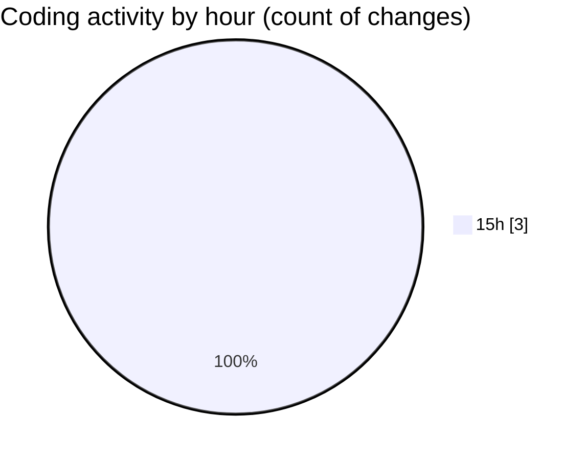

# MyWS (Workspace) - Activity Summary 

## Overall Statistics

| Stat                   | Value                                                             |
| ---------------------- | ----------------------------------------------------------------- |
| **Lines Added** (➕)   | 29                                          |
| **Lines Removed** (➖) | 0                                        |
| **Net Change** (↕)    | 29                |
| **Active Time** (⌚)   | 6 minutes |

## Modified Files
- **rename.py** (+29, -0)

## Visualizations

### By File Type (Lines Changed)

### By Hour (Estimated Activity Count)

> **Last Updated:** 24/04/2025, 15:23:03