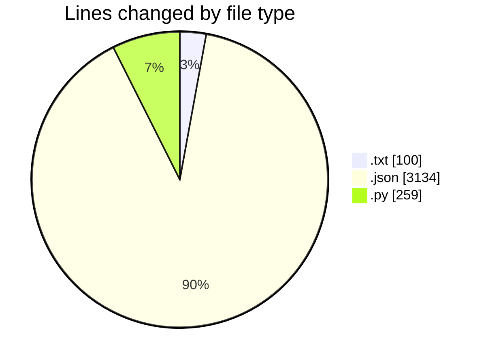
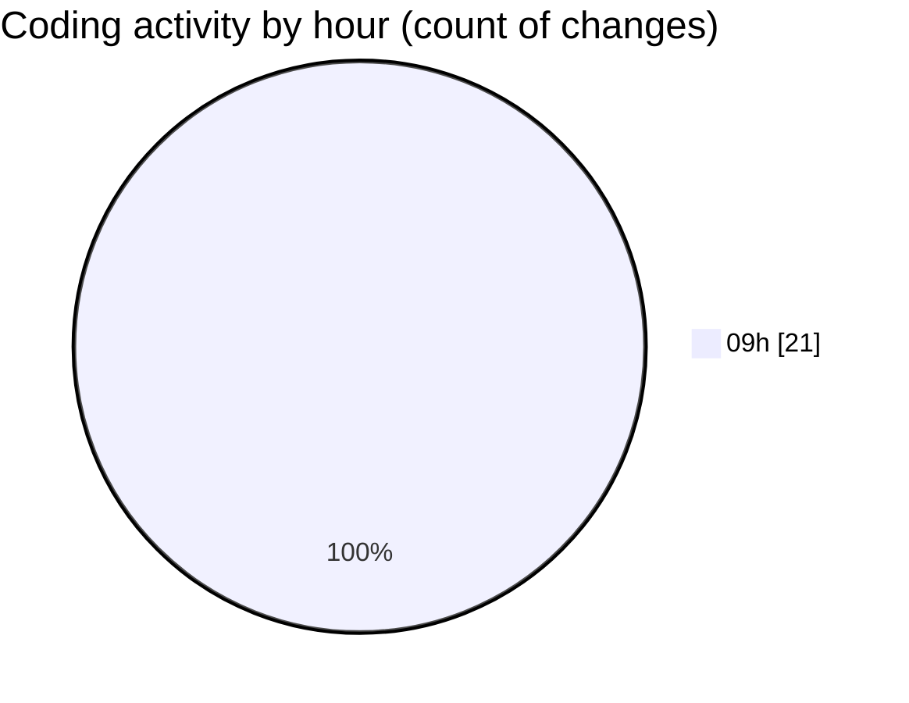

# MyWS (Workspace) - Activity Summary 

## Overall Statistics

| Stat                   | Value                                                             |
| ---------------------- | ----------------------------------------------------------------- |
| **Lines Added** (➕)   | 3493                                          |
| **Lines Removed** (➖) | 0                                        |
| **Net Change** (↕)    | 3493                |
| **Active Time** (⌚)   | 32 minutes |

## Modified Files
- **configuration.txt** (+48, -0)
- **test_drive_down_architecture.json** (+728, -0)
- **transform.py** (+71, -0)
- **test_drive_down_architecture_old.json** (+728, -0)
- **test_architecture.json** (+728, -0)
- **test_drive_architecture.json** (+950, -0)
- **prepare_dataset_RIDB.py** (+188, -0)
- **configuration_drive.txt** (+52, -0)

## Visualizations

### By File Type (Lines Changed)

### By Hour (Estimated Activity Count)

> **Last Updated:** 30/04/2025, 09:59:05