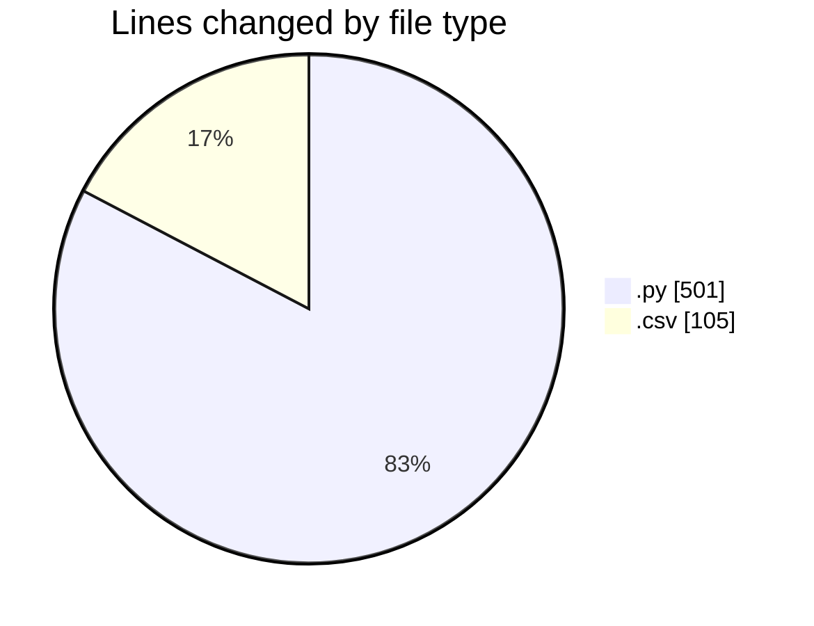
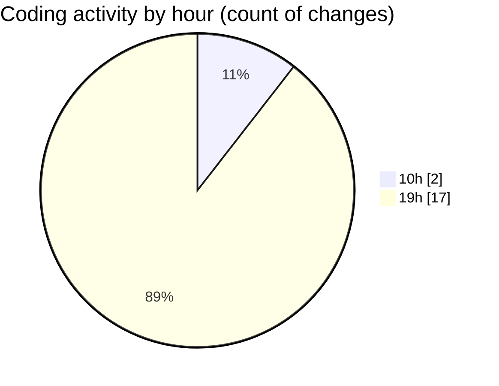

# MyWS (Workspace) - Activity Summary 

## Overall Statistics

| Stat                   | Value                                                             |
| ---------------------- | ----------------------------------------------------------------- |
| **Lines Added** (➕)   | 586                                          |
| **Lines Removed** (➖) | 20                                        |
| **Net Change** (↕)    | 566                |
| **Active Time** (⌚)   | 23 minutes |

## Modified Files
- **analyze_results.py** (+251, -0)
- **test_all.csv** (+103, -2)
- **create_ridb_csv.py** (+26, -0)
- **get_loaders.py** (+206, -18)

## Visualizations

### By File Type (Lines Changed)

### By Hour (Estimated Activity Count)

> **Last Updated:** 04/05/2025, 19:45:19