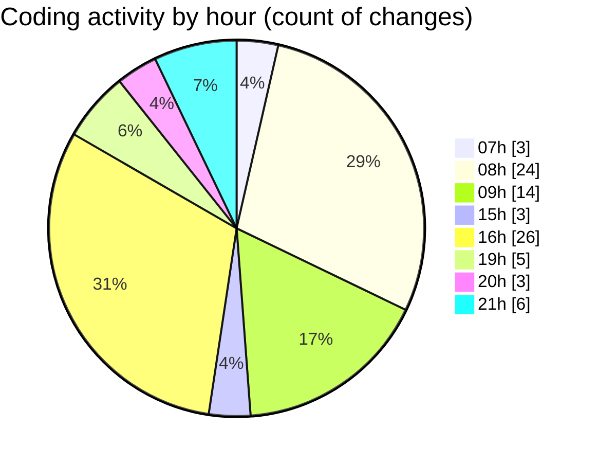

# MyWS (Workspace) - Activity Summary 

## Overall Statistics

| Stat                   | Value                                                             |
| ---------------------- | ----------------------------------------------------------------- |
| **Lines Added** (➕)   | 14756                                          |
| **Lines Removed** (➖) | 3750                                        |
| **Net Change** (↕)    | 11006                |
| **Active Time** (⌚)   | 105 minutes |

## Modified Files
- **compute.ipynb** (+13512, -3655)
- **00_non_visual.py** (+1244, -95)

## Visualizations

### By File Type (Lines Changed)

### By Hour (Estimated Activity Count)

> **Last Updated:** 07/05/2025, 21:41:26