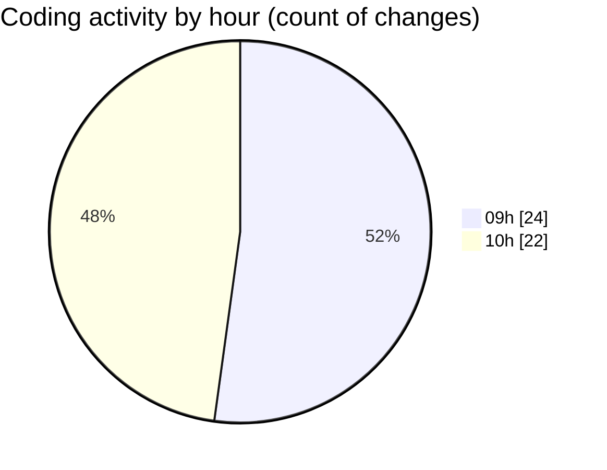

# MyWS (Workspace) - Activity Summary 

## Overall Statistics

| Stat                   | Value                                                             |
| ---------------------- | ----------------------------------------------------------------- |
| **Lines Added** (➕)   | 1424                                          |
| **Lines Removed** (➖) | 121                                        |
| **Net Change** (↕)    | 1303                |
| **Active Time** (⌚)   | 42 minutes |

## Modified Files
- **00_non_visual.py** (+39, -92)
- **09_robust.py** (+1233, -21)
- **10_extract.py** (+152, -8)

## Visualizations

### By File Type (Lines Changed)

### By Hour (Estimated Activity Count)

> **Last Updated:** 08/05/2025, 10:31:33