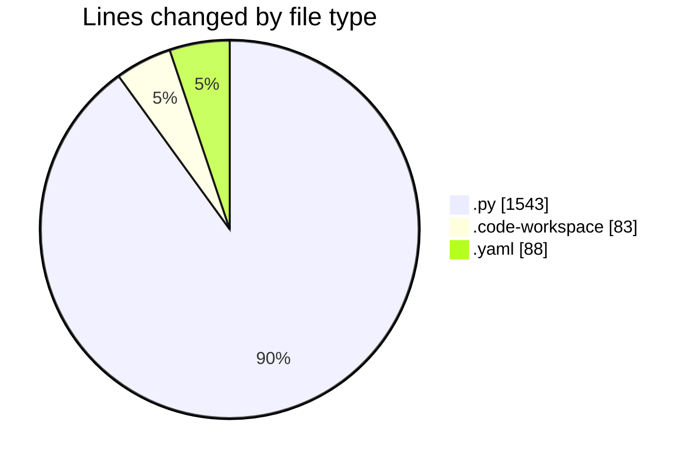
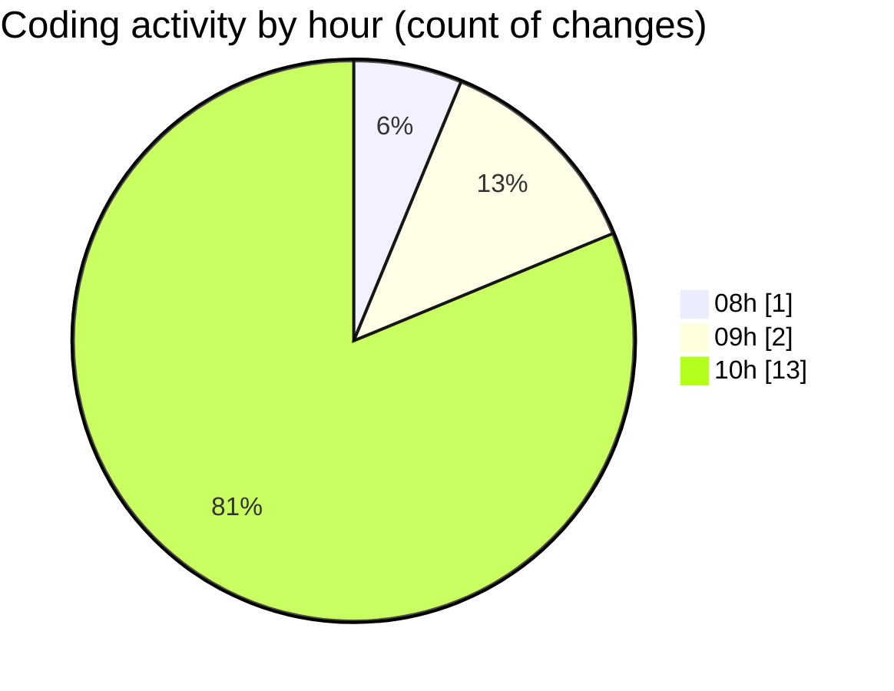

# MyWS (Workspace) - Activity Summary 

## Overall Statistics

| Stat                   | Value                                                             |
| ---------------------- | ----------------------------------------------------------------- |
| **Lines Added** (➕)   | 1714                                          |
| **Lines Removed** (➖) | 0                                        |
| **Net Change** (↕)    | 1714                |
| **Active Time** (⌚)   | 13 minutes |

## Modified Files
- **prepare_dataset_RIDB.py** (+30, -0)
- **run_predict_ridb_all.py** (+150, -0)
- **MyWS.code-workspace** (+83, -0)
- **00_train_model.py** (+637, -0)
- **auth_class.py** (+72, -0)
- **config.yaml** (+88, -0)
- **test_auth.py** (+469, -0)
- **split_to_ttv.py** (+73, -0)
- **resize.py** (+112, -0)

## Visualizations

### By File Type (Lines Changed)

### By Hour (Estimated Activity Count)

> **Last Updated:** 15/05/2025, 10:11:43