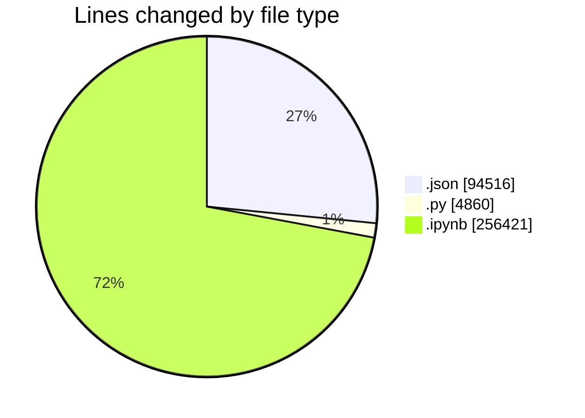
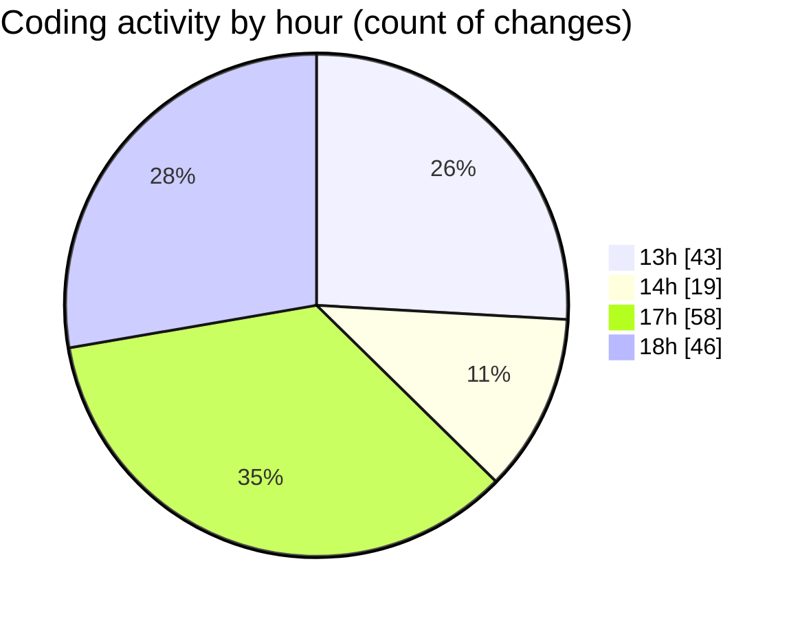

# Untitled (Workspace) - Activity Summary 

## Overall Statistics

| Stat                   | Value                                                             |
| ---------------------- | ----------------------------------------------------------------- |
| **Lines Added** (➕)   | 288587                                          |
| **Lines Removed** (➖) | 67210                                        |
| **Net Change** (↕)    | 221377                |
| **Active Time** (⌚)   | 217 minutes |

## Modified Files
- **workspace.json** (+15, -0)
- **example.py** (+355, -0)
- **demo.py** (+3591, -0)
- **garmin.ipynb** (+189458, -66963)
- **2025-03-18_2025-06-26_111308063_sleepData.json** (+1815, -0)
- **garmin.py** (+667, -247)
- **2023-11-04_2024-02-12_111308063_sleepData.json** (+1339, -0)
- **2023-04-18_2023-07-27_111308063_sleepData.json** (+1485, -0)
- **2023-01-08_2023-04-18_111308063_sleepData.json** (+832, -0)
- **2023-07-27_2023-11-04_111308063_sleepData.json** (+1327, -0)
- **2024-02-12_2024-05-22_111308063_sleepData.json** (+1355, -0)
- **2024-05-22_2024-08-30_111308063_sleepData.json** (+1442, -0)
- **2024-08-30_2024-12-08_111308063_sleepData.json** (+1482, -0)
- **2024-12-08_2025-03-18_111308063_sleepData.json** (+1495, -0)
- **2025-06-26_2025-10-04_111308063_sleepData.json** (+1688, -0)
- **UDSFile_2023-01-08_2023-04-18.json** (+8708, -0)
- **UDSFile_2025-03-19_2025-06-27.json** (+33596, -0)
- **2025-06-28_2025-10-06_125740581_sleepData.json** (+3337, -0)
- **UDSFile_2024-12-09_2025-03-19.json** (+34600, -0)

## Visualizations

### By File Type (Lines Changed)

### By Hour (Estimated Activity Count)

> **Last Updated:** 04/10/2025, 18:51:58