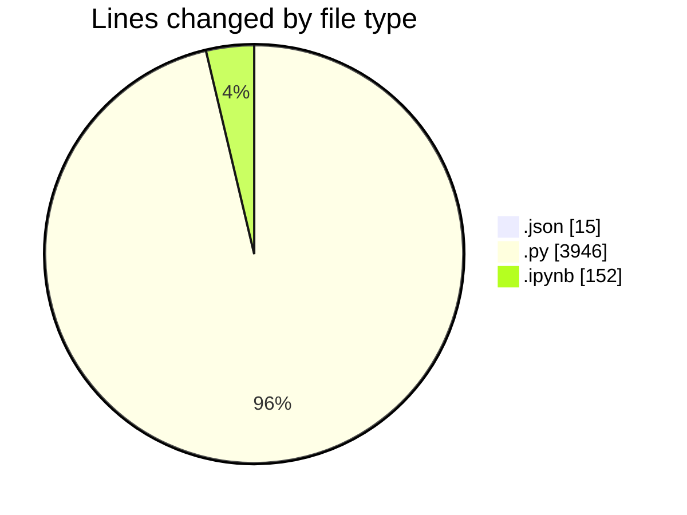
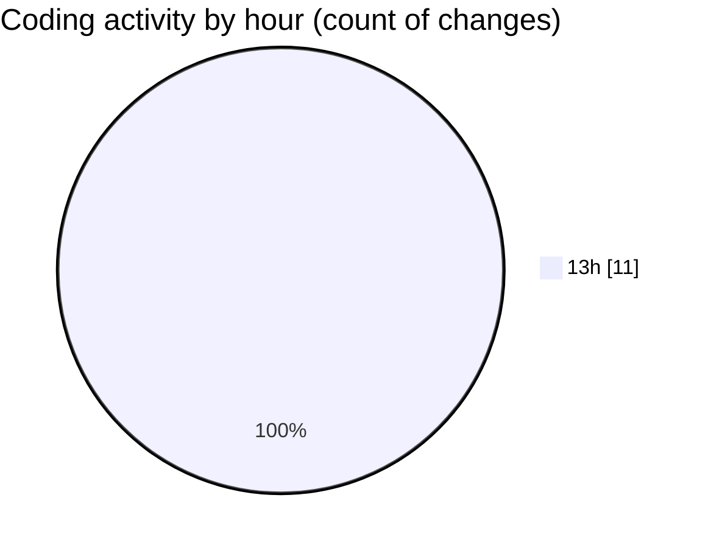

# Untitled (Workspace) - Activity Summary 

## Overall Statistics

| Stat                   | Value                                                             |
| ---------------------- | ----------------------------------------------------------------- |
| **Lines Added** (➕)   | 4112                                          |
| **Lines Removed** (➖) | 1                                        |
| **Net Change** (↕)    | 4111                |
| **Active Time** (⌚)   | 16 minutes |

## Modified Files
- **workspace.json** (+15, -0)
- **example.py** (+355, -0)
- **demo.py** (+3591, -0)
- **garmin.ipynb** (+151, -1)

## Visualizations

### By File Type (Lines Changed)

### By Hour (Estimated Activity Count)

> **Last Updated:** 04/10/2025, 13:54:58