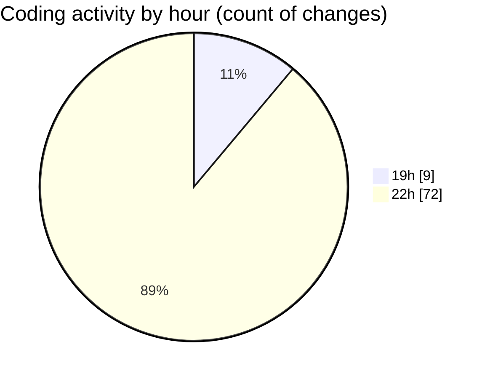

# Untitled (Workspace) - Activity Summary 

## Overall Statistics

| Stat                   | Value                                                             |
| ---------------------- | ----------------------------------------------------------------- |
| **Lines Added** (➕)   | 101919                                          |
| **Lines Removed** (➖) | 37499                                        |
| **Net Change** (↕)    | 64420                |
| **Active Time** (⌚)   | 86 minutes |

## Modified Files
- **garminOld.py** (+171, -167)
- **garmin.ipynb** (+28672, -27379)
- **pice.ipynb** (+73076, -9953)

## Visualizations

### By File Type (Lines Changed)

### By Hour (Estimated Activity Count)

> **Last Updated:** 07/10/2025, 23:02:00