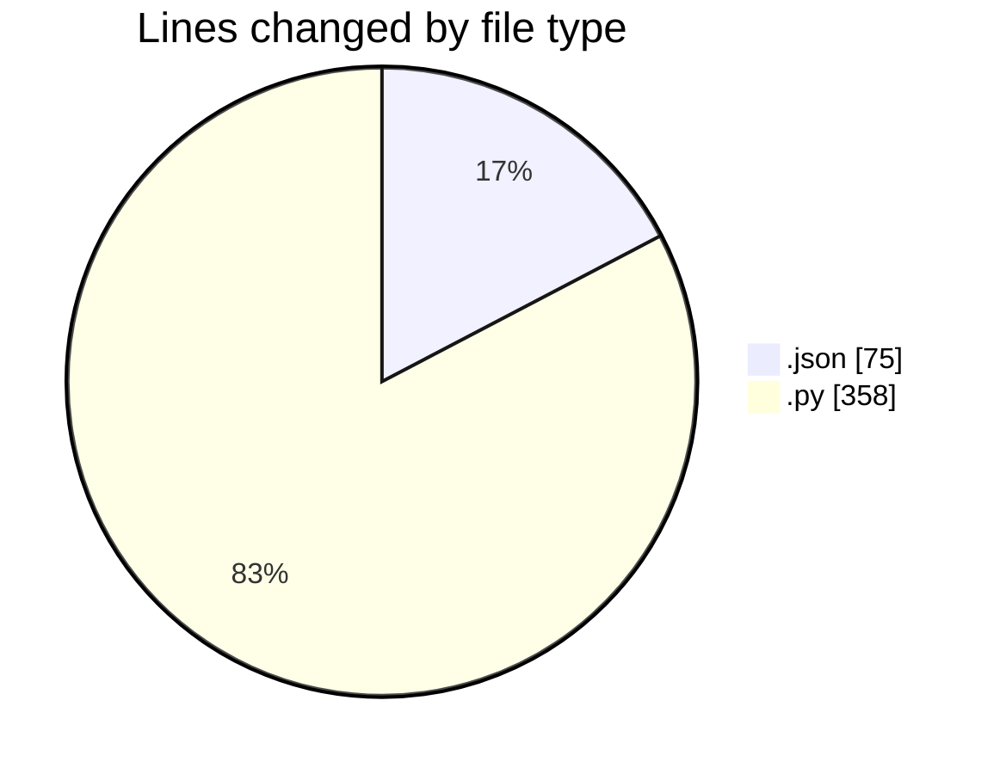

# Untitled (Workspace) - Activity Summary 

## Overall Statistics

| Stat                   | Value                                                             |
| ---------------------- | ----------------------------------------------------------------- |
| **Lines Added** (➕)   | 364                                          |
| **Lines Removed** (➖) | 69                                        |
| **Net Change** (↕)    | 295                |
| **Active Time** (⌚)   | 51 minutes |

## Modified Files
- **workspace.json** (+3, -0)
- **clusty.py** (+166, -43)
- **marathon-plan.json** (+72, -0)
- **clustyAgent.py** (+123, -26)

## Visualizations

### By File Type (Lines Changed)

### By Hour (Estimated Activity Count)

> **Last Updated:** 08/10/2025, 22:53:47