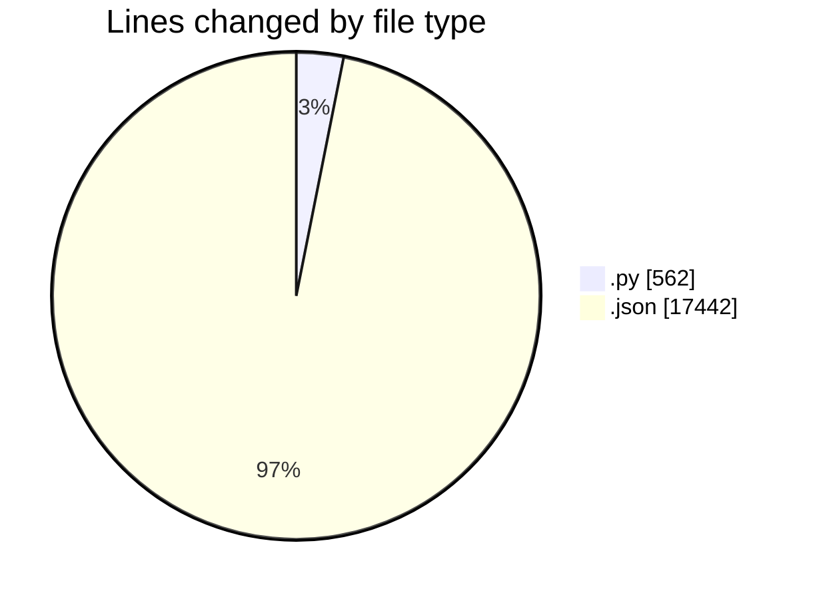
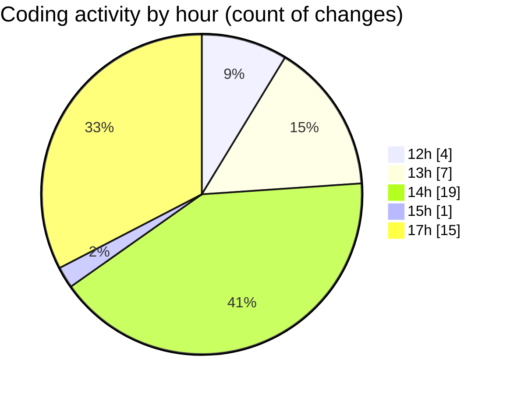

# Untitled (Workspace) - Activity Summary 

## Overall Statistics

| Stat                   | Value                                                             |
| ---------------------- | ----------------------------------------------------------------- |
| **Lines Added** (➕)   | 17946                                          |
| **Lines Removed** (➖) | 58                                        |
| **Net Change** (↕)    | 17888                |
| **Active Time** (⌚)   | 72 minutes |

## Modified Files
- **clusty.py** (+504, -58)
- **openapi-spec.json** (+17442, -0)

## Visualizations

### By File Type (Lines Changed)

### By Hour (Estimated Activity Count)

> **Last Updated:** 25/10/2025, 17:48:22