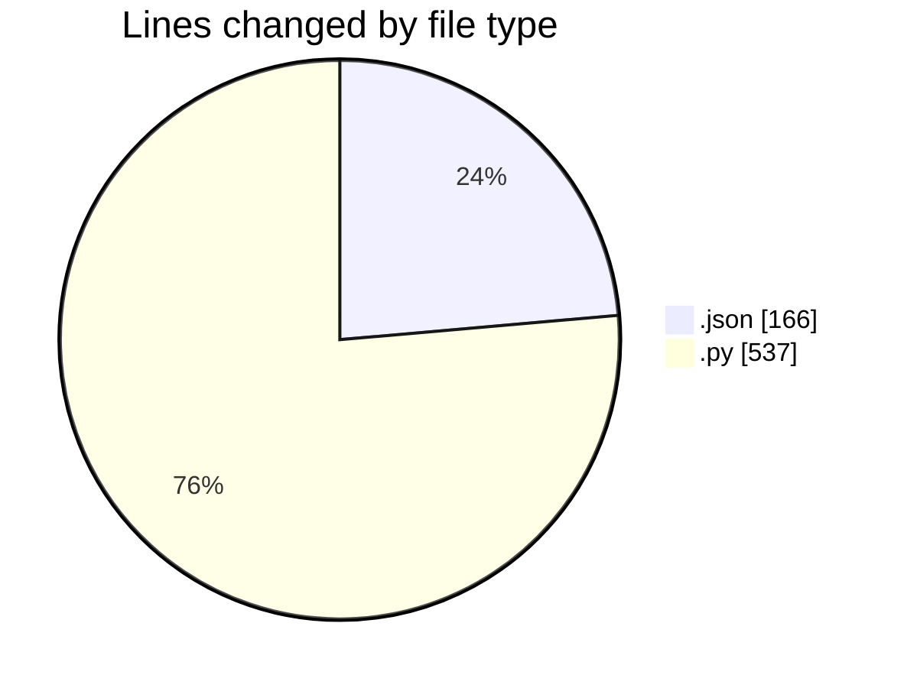
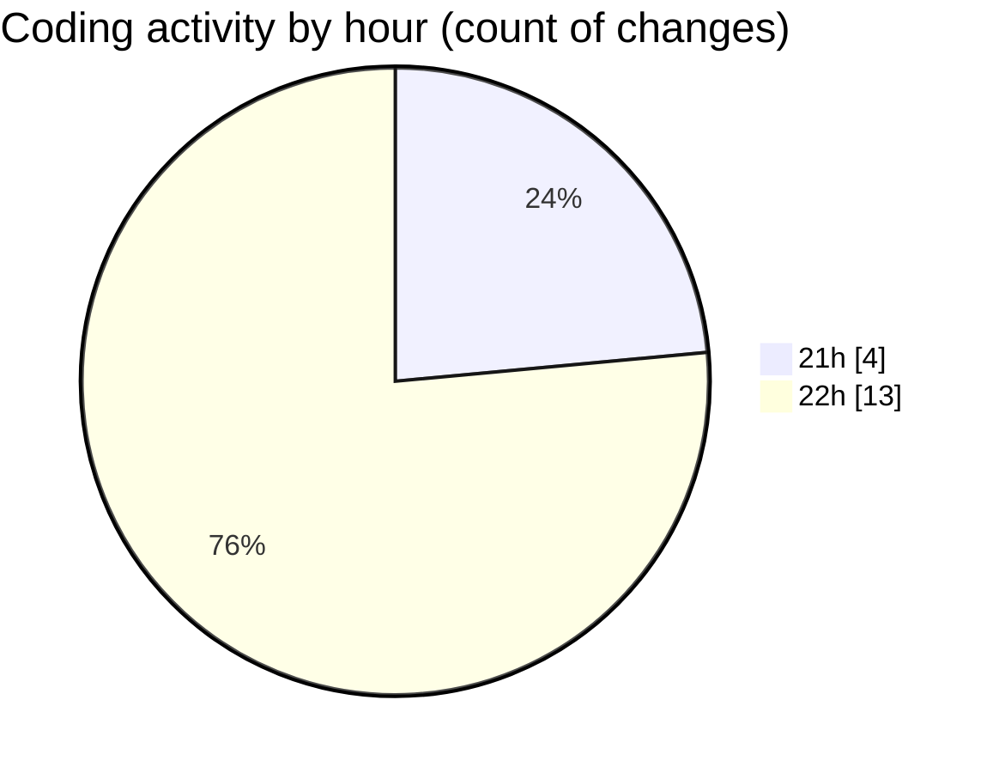

# Untitled (Workspace) - Activity Summary 

## Overall Statistics

| Stat                   | Value                                                             |
| ---------------------- | ----------------------------------------------------------------- |
| **Lines Added** (➕)   | 544                                          |
| **Lines Removed** (➖) | 159                                        |
| **Net Change** (↕)    | 385                |
| **Active Time** (⌚)   | 23 minutes |

## Modified Files
- **workspace.json** (+21, -0)
- **test.py** (+377, -159)
- **config.py** (+1, -0)
- **test.json** (+145, -0)

## Visualizations

### By File Type (Lines Changed)

### By Hour (Estimated Activity Count)

> **Last Updated:** 14/11/2025, 22:21:25