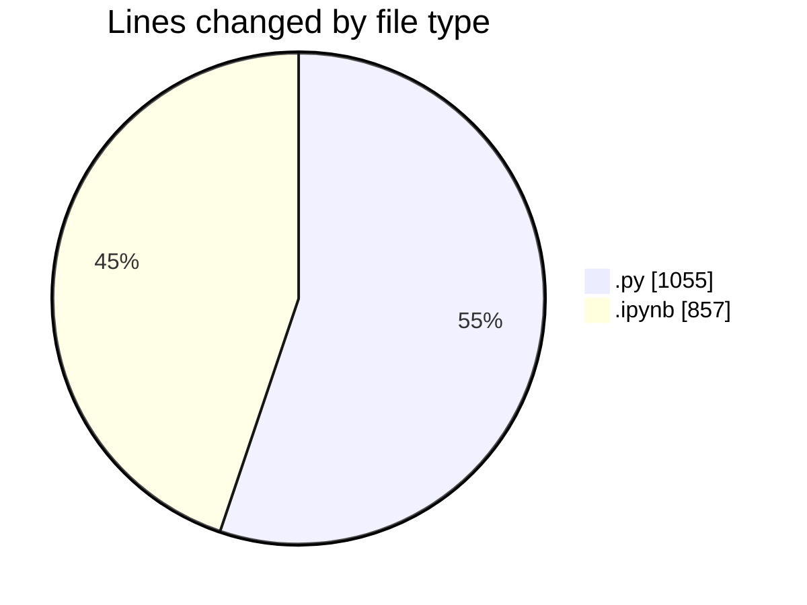
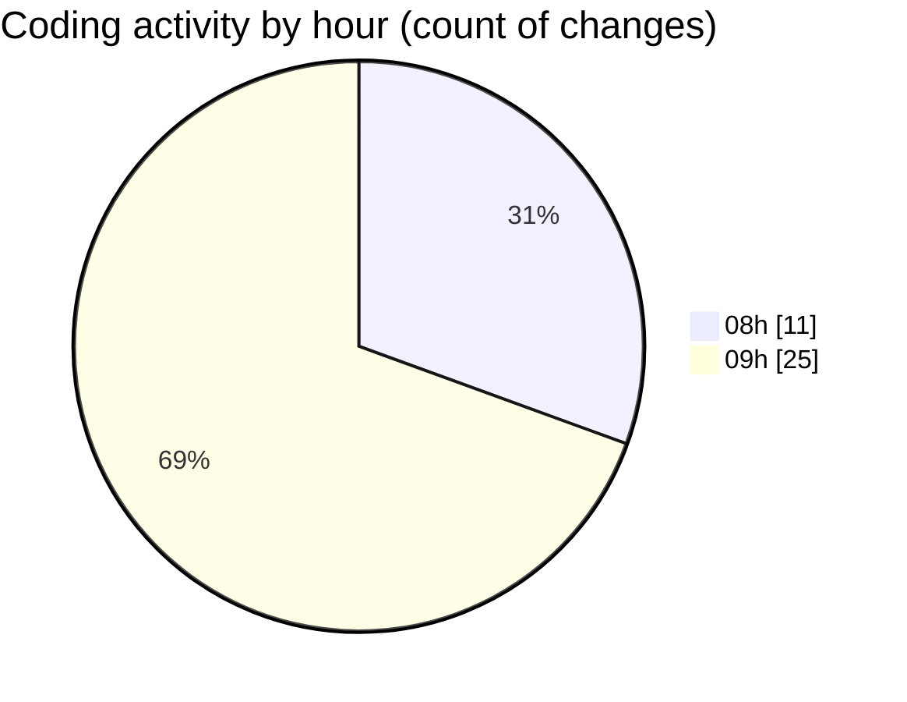

# Untitled (Workspace) - Activity Summary 

## Overall Statistics

| Stat                   | Value                                                             |
| ---------------------- | ----------------------------------------------------------------- |
| **Lines Added** (➕)   | 1470                                          |
| **Lines Removed** (➖) | 442                                        |
| **Net Change** (↕)    | 1028                |
| **Active Time** (⌚)   | 47 minutes |

## Modified Files
- **test.py** (+78, -1)
- **mistral.py** (+538, -437)
- **config.py** (+1, -0)
- **document_understanding.ipynb** (+336, -0)
- **test.ipynb** (+517, -4)

## Visualizations

### By File Type (Lines Changed)

### By Hour (Estimated Activity Count)

> **Last Updated:** 15/11/2025, 09:47:15