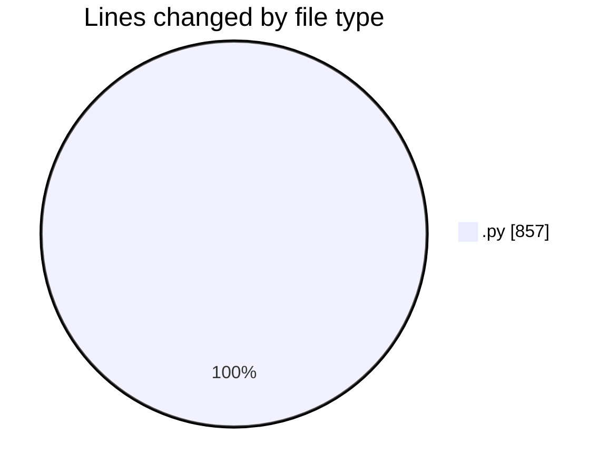
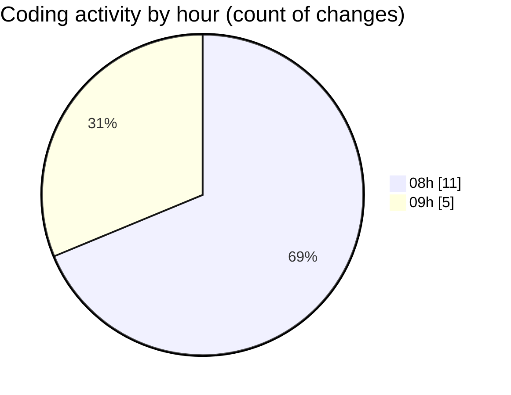

# Untitled (Workspace) - Activity Summary 

## Overall Statistics

| Stat                   | Value                                                             |
| ---------------------- | ----------------------------------------------------------------- |
| **Lines Added** (➕)   | 576                                          |
| **Lines Removed** (➖) | 281                                        |
| **Net Change** (↕)    | 295                |
| **Active Time** (⌚)   | 14 minutes |

## Modified Files
- **test.py** (+78, -1)
- **mistral.py** (+498, -280)

## Visualizations

### By File Type (Lines Changed)

### By Hour (Estimated Activity Count)

> **Last Updated:** 15/11/2025, 09:07:15