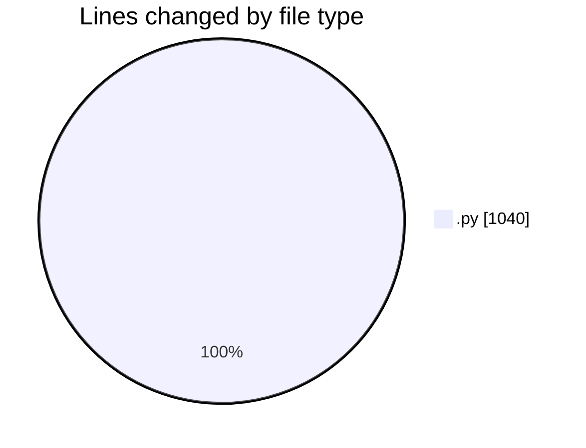
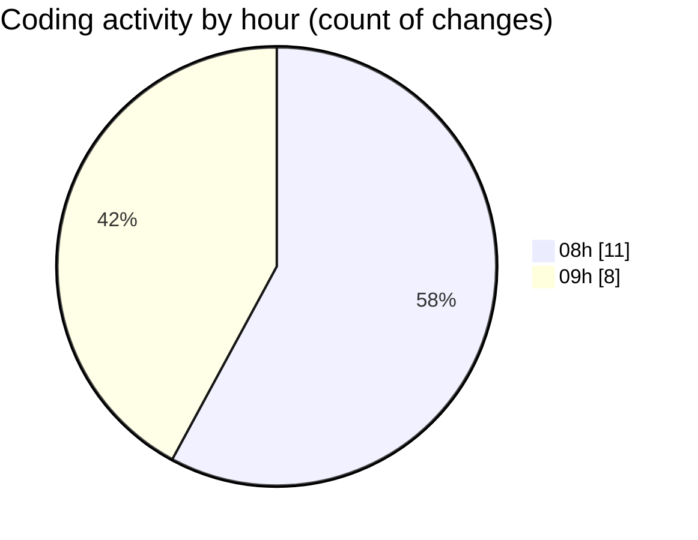

# Untitled (Workspace) - Activity Summary 

## Overall Statistics

| Stat                   | Value                                                             |
| ---------------------- | ----------------------------------------------------------------- |
| **Lines Added** (➕)   | 604                                          |
| **Lines Removed** (➖) | 436                                        |
| **Net Change** (↕)    | 168                |
| **Active Time** (⌚)   | 24 minutes |

## Modified Files
- **test.py** (+78, -1)
- **mistral.py** (+526, -435)

## Visualizations

### By File Type (Lines Changed)

### By Hour (Estimated Activity Count)

> **Last Updated:** 15/11/2025, 09:17:15