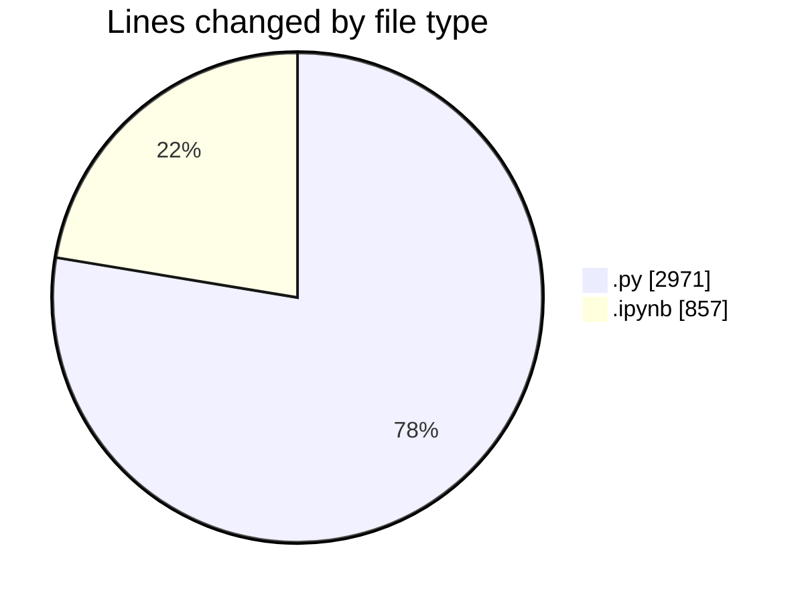
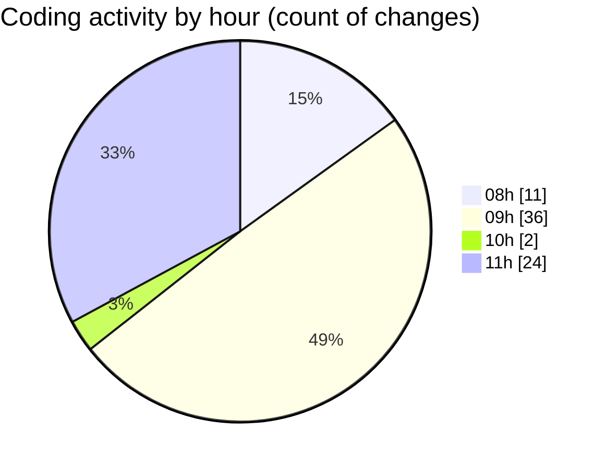

# Untitled (Workspace) - Activity Summary 

## Overall Statistics

| Stat                   | Value                                                             |
| ---------------------- | ----------------------------------------------------------------- |
| **Lines Added** (➕)   | 2953                                          |
| **Lines Removed** (➖) | 875                                        |
| **Net Change** (↕)    | 2078                |
| **Active Time** (⌚)   | 85 minutes |

## Modified Files
- **test.py** (+78, -1)
- **mistral.py** (+538, -437)
- **config.py** (+1, -0)
- **document_understanding.ipynb** (+336, -0)
- **test.ipynb** (+517, -4)
- **test2.py** (+367, -0)
- **extract_pdf_to_markdown.py** (+93, -8)
- **extract_json_from_md.py** (+385, -280)
- **instruction.py** (+583, -145)
- **to_excel.py** (+55, -0)

## Visualizations

### By File Type (Lines Changed)

### By Hour (Estimated Activity Count)

> **Last Updated:** 15/11/2025, 12:02:16