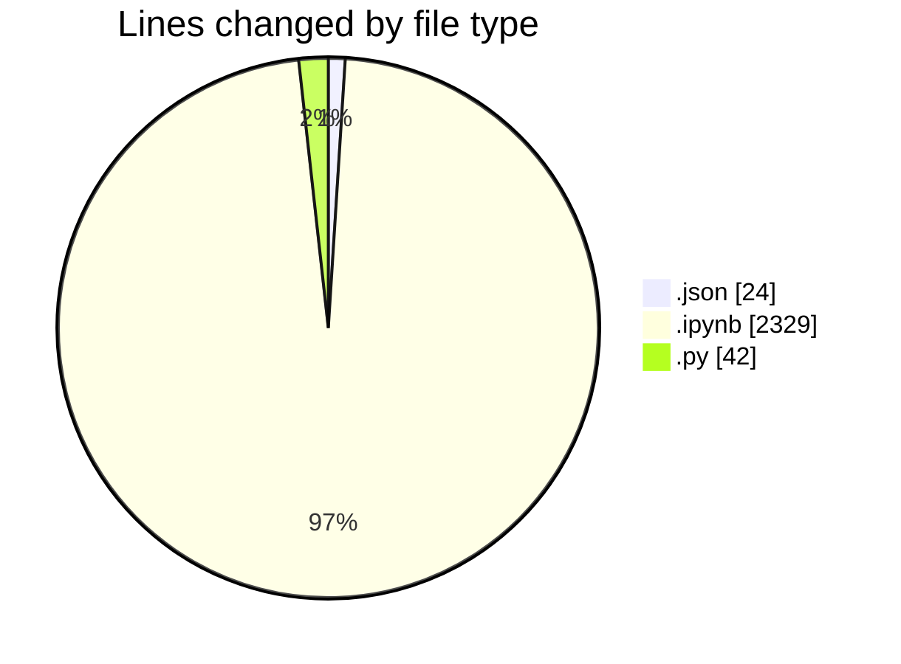
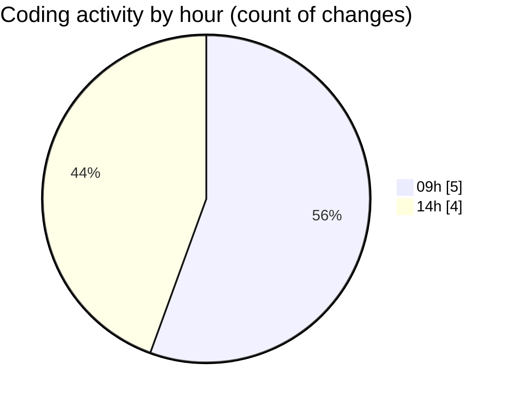

# Untitled (Workspace) - Activity Summary 

## Overall Statistics

| Stat                   | Value                                                             |
| ---------------------- | ----------------------------------------------------------------- |
| **Lines Added** (➕)   | 2395                                          |
| **Lines Removed** (➖) | 0                                        |
| **Net Change** (↕)    | 2395                |
| **Active Time** (⌚)   | 12 minutes |

## Modified Files
- **workspace.json** (+24, -0)
- **notebook.ipynb** (+2329, -0)
- **config.py** (+3, -0)
- **johitest.py** (+39, -0)

## Visualizations

### By File Type (Lines Changed)

### By Hour (Estimated Activity Count)

> **Last Updated:** 25/11/2025, 14:20:07